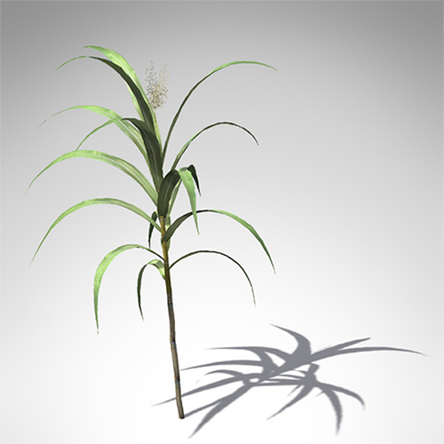

### 1 – Abstract

First introduced into Louisiana in 1751, sugarcane (Saccharum officinarum) is the highest valued row-crop in the state. Its continuous production is an important historic and economic component of Louisiana’s overall economy. While recent decades have seen a drop in Louisiana sugarcane acreage, crop values have remained stable due to increases in sucrose yield. Significant increases in yield are mainly attributable to the addition of nitrogen (N) fertilizer.

###### Figure 1. Saccharum officinarum (Sugarcane).

#### Problem
As the amount of harvested sugarcane declines, sugarcane growers in Louisiana are under pressure to boost their operational efficiency in order to sustain this economically vital crop. It is essential that producers apply new and proven technology in order to mitigate the cost of production, maximize yield, and limit impact on the environment.

#### Current Methods
Intensive agricultural production systems, like sugarcane, typically require a higher input rate of nitrogen (N) to achieve sufficient biomass and yield. Along with rate optimization the timing of N application is likewise important. Current methods employed to determine N status in sugarcane include visual inspection, tissue analysis, and chlorophyll monitoring. Soil analysis is used to gauge N content, but the reliability of sampling is inconclusive in the humid soils of southern Louisiana. Continuous refinement of effective and affordable N management systems is essential to maintain sustainable sugarcane agriculture in Louisiana.

#### The Value of Vegetation Indices
Our study considers the use of low-cost vegetation indices such as aerial NDVI as an addition to the overall N management scheme specific to sugarcane production in Louisiana. The Normative Difference Vegetation Index (NDVI) is a form of hyper-spectral imaging that collects and processes information across various wavelengths of the electromagnetic spectrum. In agriculture, the goal of NDVI imaging is to detect the relative strength of photosynthetic processes occurring in the field. While vegetation indices like NDVI have been applied in agriculture, the primary disadvantage of these methods has traditionally been their cost and complexity. 

#### Study Goals
Our primary goal has been to determine to what extent low-cost aerial NDVI might be correlated with variable N rates applied to sugarcane. A secondary goal is to determine to what extent time-series analysis of low-cost NDVI imagery might be used to predict yield potential in sugarcane.

We asked two questions: 

* Can variable nitrogen rates applied to sugarcane be correlated with low-cost multi-spectral imagery?
* Are models of acquired multi-spectral imagery predictive of sugarcane yield?

#### Access to Technology
Studies on Louisiana sugarcane growth indicate that remote sensing methods like NDVI may be effective in predicting sucrose yield in response to applied N fertilizer. Yet access to these technologies by farmers is limited; acquiring, processing and interpreting such data is costly and time-consuming. While high-resolution aerial imagery such as NDVI holds the potential to improve operational efficiency, economic factors prevent their general adoption by Louisiana sugarcane growers.

High temporal and spatial resolution NDVI can provide a host of potential uses in agriculture in addition: prescribing N fertilizer amounts and estimating crop yield are two of the potential benefits to Louisiana sugarcane producers. Yet a ‘chicken and egg’ problem exists in allocating time and resources necessary for technology that has yet to be been proven in the field. Our study intends to make these tools available, in order to refine and measure their effectiveness.

### Project Objectives
Our report provides background and results of a two-year study on the feasibility of using different multi-spectral indices to predict sucrose yield in sugarcane. A goal has been to explore methods that are accessible in terms of cost and complexity when compared with traditional methods. We also offer guidance regarding the efficacy of the tools and methods considered.

Our report is organized into twelve sections. At the end of each section there is a link back to the Table of Contents.

* [Abstract](abstract.md) 
    * This document.
* [Through the Eyes of a Plant](how_plants_see.md)
    * An introduction to the biology of plant life. 
* [Background on Methods](study_methods.md)
    * An overview of approaches used this study. 
* [Kites, Balloons, and Drones](kites_balloons_drones.md)
    * A description of low-cost aerial options available, their strengths and weaknesses.
* [Varieties of Spectral Index](spectral_indices.md)
    * A look at the kind of vegetation index used in this study.
* [Pre-Processing Steps](pre_processing_steps.md)
    * How raw image data were initially prepared.
* [Post-Processing Steps](post_pricessing_steps.md)
    * How the image data were prepared for statistical analysis.
* [Study Results I – Balloons and Kites](study_results_balloons.md)
    * Results when using balloons and kites.
* [Study Results II – Aerial Drones](study_results_drones.md)
    * Results when using Unassisted Autonomous Vehicles (UAVs), i.e. aerial drones. 
* [Summary](summary.md)
    * What we’ve learned so far.
* [Credits](credits.md)
    * Credits and appreciation. 
* [References](references.md)
    * Comprehensive listing of resources used in this study.
    
### Acknowledgements
This work was funded by the __Sustainable Agriculture Research & Education__ program at USDA (also known as __SARE__). 
SARE is a USDA granting and outreach provider for farmers, researchers and educators seeking to develop innovative
projects. The goal of the SARE Producer Grant program is to provide the working farmer an opportunity to conduct projects 
that address specific challenges while developing information on what works and doesn’t work. A core mission is to provide 
information to other farmers who may be facing similar challenges.

#### Next section: [Through the Eyes of a Plant](how_plants_see.md)