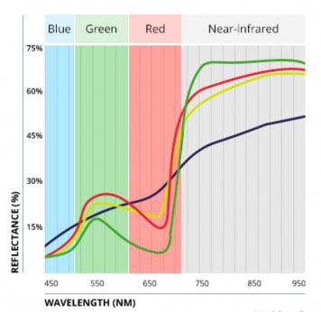
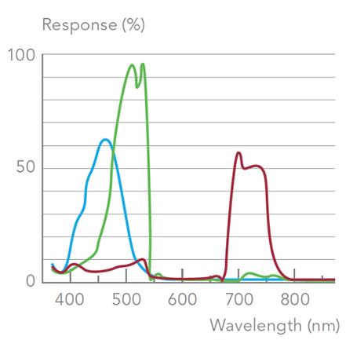
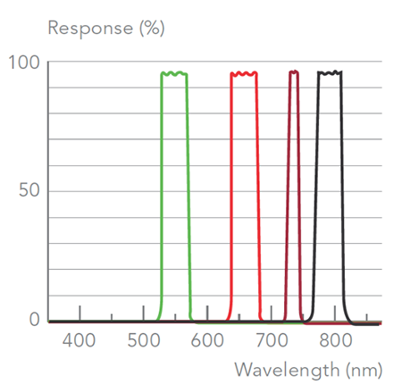

### Section 2 - Through the Eyes of a Plant

#### Basic Plant Biology

* Plants use chlorophyll, water, and carbon dioxide to synthesize sugars.
* Chloroplasts cells contain chlorophyll which absorbs light, mainly in Red and Blue wavelengths.

Our study sought to provide an assessment regarding the use of aerial imaging to determine the health and productivity of sugarcane. Before discussing our work, we first consider some basic principles of what such systems measure and how they achieve their results.

Photosynthesis is the process used by plants to synthesize sugar from carbon dioxide and water. The leaves of a plant contain photosynthetic engines known as chloroplasts. When sunlight hits these cells they absorb the Red and Blue wavelengths of light while reflecting away most others. Water, carbon dioxide, and __filtered light__ produce sugars for the plant and oxygen for the environment.

#### Blue, Green, Red and Near Infra Red (NIR)

* Healthy plants absorb Red and Blue bands of light while reflecting away most of the NIR.
* Near infrared (NIR) light is generally damaging to plants.

Light visible to the human eye lies roughly between 380 and 750 nanometers (nm) along the electromagnetic spectrum. Plants are also receptive to light though the mechanisms involved are distinct from humans. The more healthy a plant is – i.e. the more photosynthesis it carries out – the more Red it tends to absorb. This behavior is correlated with the functional health of chloroplast cells as these are the drivers of photosynthesis.

If a plant’s chloroplasts are damaged they will tend to absorb less Red light while reflecting away less near infrared (NIR). The ability to photosynthesize and produce sugar will likewise be diminished. Plants also absorb Blue, in fact they absorb more Blue than Red, however the rate of photosynthesis is higher in terms of the amount of Red absorbed.

In addition to absorbing Red (and Blue) and reflecting Green, healthy plants reflect away most of the NIR. NIR light is not visible to humans and neither may plants convert this higher energy form of light to useful work. It is in part to avoid the damage that NIR might otherwise cause that plants reflect most of it away.

###### Figure 1. Spectral signature showing behavior of healthy (green), stressed (red), nitrogen deficient (yellow), and necrotic (purple). 

In __Figure 1__ reflectance values are on the ‘y’ (vertical) axis while the wavelength of light is on the ‘x’ (horizontal) axis. In healthy plants Blue is largely absorbed and only a little is reflected. As we move into the Green the amount of reflectance increases. In the Red it is again diminished while in the NIR (the grey region) almost all is reflected away.

In addition to showing the ‘spectral signature’ of a generic plant this graph indicates important differences between healthy and unhealthy plants. The green line shows the reflectance profile of a healthy plant while the red line indicates a distressed one. Note that unhealthy plants absorb less in the Blue and Red while absorbing more (reflecting much less) in the NIR portion.

The spectral signature of sugarcane generally follows that of any other green leafy plant – it absorbs 60 to 85 percentage of incident light minus the Green band (most is reflected away, hence leaves appear green to us) and minus most of the NIR light. Sugarcane’s outer leaf is nearly transparent to infrared light while its inner mesophyll scatters this radiation either upward (reflection) or downward (transmission).

In recent decades remote sensing technology has improved and use of multi-spectral imagery has become an effective tool in monitoring vegetation conditions. The goal in gathering multi-spectral imagery for crop monitoring is to use a camera with sufficient sensitivity in all bands of the spectrum. As the price of sensors has continued to drop the range of options has increased, sometimes dramatically.    
 

###### Figure 2. Spectral signature of a typical consumer-type RGB camera.

__Figure 2__ highlights the spectral characteristic of a generic consumer camera. The graph indicates that consumer cameras are sensitive in the Red, Green and Blue parts of the spectrum but not specifically in each narrow band, i.e. the RGB bands overlap. The ‘width’ of the Blue and Red bands is 100nm while the Green is somewhat less wide. Consumer cameras are not designed to separate each band of light which is acceptable in the context of taking consumer pictures. When the intended goal is to provide separation for purposes of quantifying luminosity values it’s less than ideal.

#### Professional Multi-Spectral Cameras
* Multi-spectral cameras are tuned to capture multiple, narrow bands of light.
* The ‘spectral signature’ of a plant can help us understand its health and productivity.
 
Our study made use of consumer cameras as tools for gathering multi-spectral imagery with mixed results. An alternative to consumer-grade RGB cameras is a more expensive camera designed from the ground up to function as a true narrow-band instrument. Specialized multi-spectral cameras contain ‘band-pass’ filters which taper each wavelength of light. Gaining access to a narrower band in this way allows for more precise estimation of luminosity values.

###### Figure 3. Narrow band spectral response of a Parrot Sequoia camera.

In __Figure 3__ the spectral response of a Parrot Sequoia camera is shown. With this camera Green is captured in the 530–570 nm band with peak absorption around 550 nm. The reflectance of Green is often correlated with leaf chlorophyll content. Variation in the Red band (660nm) often reflects changing attributes such as biomass, humidity and stress. Red reflectance also helps to distinguish plant from soil material.

Following Red is a very narrow band known as the Red Edge (730–740 nm). This band corresponds to the abrupt switch that occurs between Red and the higher reflectance values of NIR. An increase in Red Edge reflectance occurs often when a plant is experiencing nutrient stress.

The near infrared (NIR) band is captured in the 770-810 nm range. NIR is reflected away most when compared to the other bands and is sensitive to plant health and type. Since chlorophyll pigment does not influence NIR reflectance it is often used to ‘normalize’ the more chlorophyll-receptive bands. A drop in NIR reflectance indicates a plant under stress. The Red and NIR were the most extensively used bands in this study.  

#### Summary

In the next section we discuss different types of multi-spectral camera used in this study and provide examples of each. We also discuss strategies for managing large volumes of data that are generated by this sort of workflow. It will become apparent that managing the data along with understanding how each vegetation index performs under changing environmental conditions presents certain challenges. Open-source software and image processing tools will be used throughout to make these tasks more tractable and accessible to the average user.

 
#### Next section >> [Background on Methods](study_methods.md)
