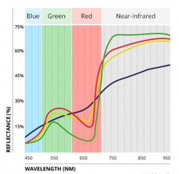
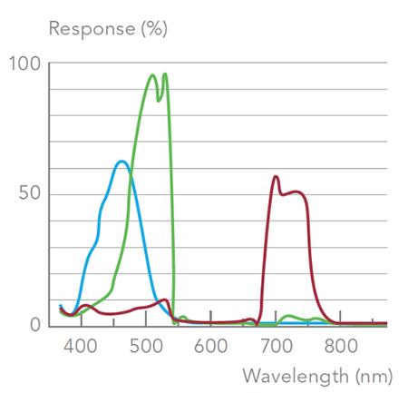
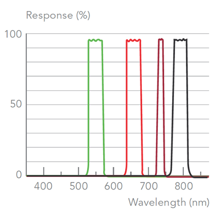

### 2 - Through the Eyes of a Plant

#### Basic Plant Biology

* Plants use chlorophyll, water, and carbon dioxide to synthesize sugar. Sugars make the plant.
* Chloroplasts cells contain chlorophyll which absorbs light, mainly in red and blue wavelengths.

While our study's purpose was to provide an assessment regarding use of aerial tools for determining the health 
and productivity of sugar cane, before discussing our approach, we first discuss basic principles of what such 
systems measure and how they achieve their results. 

Photosynthesis is the process that plants use to synthesize sugar from carbon dioxide and water. 
The leaves of a plant contain photosynthetic engines called chloroplasts. When sunlight hits these cells they absorb the 
red and blue wavelengths of light while reflecting away most of the others. Thus it is __filtered light__, along with water 
and carbon dioxide, that produces sugar for the plant and oxygen for the environment.

#### Blue, Green, Red and Near Infra Red (NIR)

* Healthy plants absorb red and blue but reflect away most of the NIR light.

Light visible to the human eye lies roughly between 380 and 750 nanometers (nm) along the continuous electromagnetic spectrum. 
Plants are also receptive to light, although the mechanism involved is quite distinct from humans. The more healthy a 
plant is - i.e. the more photosynthesis it carries out - the more red light it will tend to absorb. This tendency is 
directly related to the functional health of choloroplast cells within the plant since these are the locus of the photosynthetic process. 

If a plant's chloroplasts are compromised then it will absorb less red light and more NIR light, and its ability to 
photosynthesize and produce sugar will be diminished. Plants also absorb a lot of blue light, in fact they absorb more 
blue than red, however the rate of photosynthesis is higher in red light. 

###### Figure 1. Spectral signature showing behavior of healthy (green), stressed (red), nitrogen deficient (yellow), and necrotic (purple). 

In addition to absorbing red (and blue) and reflecting green, most healthy plants tend to reflect away most of 
the NIR light. This tendency is shown in the graph above. NIR light is not in the human visible spectrum 
and neither may plants convert the higher energy of NIR to do useful work. It is in part to avoid the 
damage that NIR might otherwise cause that plants reflect most of it away. 

In the above graph, reflectance values are on the 'y' (vertical) axis while the wavelength of light is on the 'x' 
(horizontal) axis. In healthy plants blue light is largely absorbed and only a little is reflected. As we move further 
into the green we see that the amount of reflectance increases. In the red it is again diminished while in the NIR 
(the grey region) almost all is reflected away. 

In addition to showing the generic 'spectral signature' of plants this graph also indicates the difference 
between plants that are healthy and those that are not. The green line indicates health while red demonstrates distress. 
Note that an unhealthy plant absorbs less in the blue and red parts of the spectrum while absorbing more (reflecting less) 
in the NIR portion.   
 

#### Consumer RGB Cameras
* Spectral bands collected by RGB cameras overlap, which may lead to contaminated values.
* Modified RGB cameras are difficult to calibrate.

So how does one 'see' the sorts of spectral signatures that a field of sugarcane exhibits? An obvious start (discussed in 
[Section 3](study_methods.md)) is to get the right sort of camera into the air and take a lot of pictures.
In a market that's rapidly evolving knowing how to choose the right camera at reasonable cost can be a challenge.

In a sense all cameras are multi-spectral insofar as they capture more than a single band of light. The typical consumer
camera is sensitive to light in the red, green and blue parts of the spectrum. As a rule they do 
not capture light outside of the familiar RGB range. Or do they? In fact any standard Canon Powershot (the kind you can 
find on Ebay for $100) in fact __does__ capture NIR light but this capacity has been concealed by the manufacturer (to 
reinstate it just remove a filter). Suffice it to say that mass production provides digital sensors with a
high degree of often unrealized sophistication.
 
While consumer cameras may be 'hacked' such that they absorb both visible and NIR light, a problem in doing so is 
demonstrated by the following graphic:

###### Figure 2.

__Figure 2__ highlights the spectral characteristic of a generic consumer camera. This graph indicates that consumer cameras 
are not specifically sensitive in the narrow band, i.e. the red, green and blue bands overlap. In addition,
each is fairly broad, for example the red and green bands are more than 100nm wide while the blue is somewhat less. 
Consumer cameras were not designed to separate bands of incident light which is acceptable in the context of taking 
most consumer pictures. When the intended goal is to provide separation for the purpose of quantifying values of 
each band of light it's less than ideal. 

#### Professional Multi-Spectral Cameras

* Multispectral cameras are tuned to capture multiple, narrow bands of light.
* The 'spectral signature' of a plant can help us understand its health and productivity.

An alternative to consumer-grade RGB cameras is a more expensive camera designed from the ground up to function as a 
true narrow-band multi-spectral instrument. 

###### Figure 3. Narrow band spectral response of a Parrot Sequoia camera.

Specialized multispectral cameras contain 'band-pass' filters which taper each wavelength of light into a much narrower band. 
Gaining access to a narrow band allows a far more precise estimate of the actual luminosity value reflecting off 
an object.  

In __Figure 3__  the spectral response of a Parrot Sequoia camera is shown. With this camera green light is captured in the 530–570 nm band 
with peak absorption around 550 nm. The reflectance of green is often correlated with leaf chlorophyll content. 

Red light is very strongly absorbed by plants and its variation often relates to factors such as biomass, humidity and plant stress. 
Red reflectance patterns also help distinguish plant material from soil. Red is the most extensively used band used 
when creating a vegetation index for agriculture.

Following red is a band known as Red Edge (730–740 nm). This band corresponds to the abrupt switch that occurs from red to high 
reflectance NIR light. An sharp increase in this band's reflectance occurs when a plant is under nutrient stress.

Near Infrared (NIR) light is captured in the 770-810 nm range. NIR light is reflected of all the bands. 
This band is sensitive to plant vigor and crop type. Pigments such as chlorophyll do not influence the Near Infrared so it is often used to normalize chlorophyll-sensitive wavebands. Moreover, a reduction of the reflectance in this band results when a plant is under stress. Along with the Red spectral band, Infrared is extensively used for compiling most of the vegetation indices in agriculture.   

#### Summary

In sections to come we go into greater detail about specific low and high end multi-spectral cameras including examples 
of each in action. We'll also discuss how to scale and manage large volumes of image data in this sort of workflow.  Finally, 
we'll consider along with strategies for interpreting various vegetation indices under differing environmental conditions. 
Luckily, open-source software and image processing tools exist to make these tasks more accessible to the average user.

###### References

[TBD]
 
 
