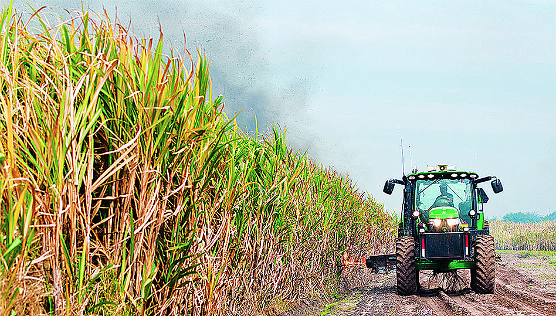

### 1 - Introduction

#### Background
First introduced into Louisiana in 1751, sugarcane (_Saccharum officinarum_) is the highest valued row-crop in the state. 
Its continuous production is an important historic and economic component of Louisiana's overall economy. While recent 
decades have seen a drop in Louisiana sugarcane acreage, crop values have remained stable due to increases in sucrose 
yield. Significant increases in yield are mainly attributable to the addition of nitrogen (N) fertilizer.

###### Figure 1.  Saccharum officinarum (Sugar Cane).

#### Problem
As the amount of harvested sugarcane declines, sugarcane growers in Louisiana are under pressure to boost operational 
efficiency in order to sustain this economically vital crop. It is essential that producers apply new and proven technology 
in order to mitigate the cost of production, maximize yield, and limit impact on the environment.

#### Current Methods
Intensive agricultural production systems, like sugarcane, typically require a higher input rate of nitrogen (N) to achieve 
sufficient biomass and yield. Along with N rate optimization the timing of application is likewise important. Continuous 
refinement of effective and affordable N management systems is essential to maintain sustainable sugarcane agriculture 
in Louisiana. Our study considers the use of low-cost vegetation indices such as aerial NDVI as an addition to the overall 
N management scheme specific to sugarcane production in Louisiana.

#### The Value of Vegetation Indices
The Normative Difference Vegetation Index (NDVI) is a form of hyper-spectral imaging that collects and processes 
information across various wavelengths of the electromagnetic spectrum. In agriculture, the goal of NDVI imaging is to 
detect the relative strength of photosynthetic processes occurring in a field. While vegetation indices 
like NDVI have been applied in agriculture, the primary disadvantage of these methods has traditionally been their cost 
and complexity. 

#### Study Goals

Our primary goal has been to determine to what extent low-cost aerial NDVI may be correlated with variable N rates 
applied to sugarcane. A secondary goal was to determine to what extent time-series analysis of low-cost NDVI imagery might 
be used to predict yield potential in sugarcane.

Methods currently employed to determine crop N status in sugarcane include visual inspection, tissue analysis, and 
chlorophyll monitoring. Soil N analysis is also utilized to gauge soil nitrogen content, but the reliability of soil sampling 
is inconclusive due to challenges associated with N monitoring in the humid alluvial soils of southern Louisiana. Our approach 
sought to address two questions:

* __Can variable nitrogen rates applied to sugarcane be correlated with low-cost multi-spectral imagery?__

* __Are models of acquired multi-spectral imagery predictive of sugarcane yield?__

#### Access to Technology
Estimating yield is a major challenge for the majority of agricultural crops. Studies on Louisiana sugarcane growth have 
shown that remote sensing methods like NDVI are effective in predicting sucrose yield in response to applied N fertilizer. 
Yet access to these technologies by farmers is limited; acquiring, processing and interpreting such data is costly and 
time-consuming. While high resolution aerial imagery such as NDVI holds the potential to improve operational efficiency, 
economic factors prevent their general adoption by Louisiana cane growers.

High temporal and spatial resolution NDVI can provide a host of potential uses in agriculture: prescribing N fertilizer 
amounts and estimating crop yield are two of the potential benefits to Louisiana sugarcane producers. Yet a 'chicken and egg' 
problem exists in allocating time and resources necessary for technology that has yet to be been proven in the field. Our 
study intends to make these tools available, in order to refine and measure their effectiveness.

#### What Follows

This report is organized into twelve sections which provide both background and results from a two-year study on the 
feasibility of using different multi-spectral indices to predict sucrose yield in sugar cane. The sections are as follows:

1. __Introduction__
    * This documemt.
2. [__Through the Eyes of a Plant__](how_plants_see.md)
    * A gentle introduction to the biology of plant life ...
3. [__Background on Methods__](study_methods.md)
    * An overview of some of the approaches considered by this study ...
4. [__Kites, Balloons, and Drones__](kites_balloons_drones.md)
    * A description of various aerial options available at low-cost ...
5. [__Varieties of Spectral Index__](spectral_indices.md)
    * A look at the kind of vegetation index used in this study ...
6. [__Pre-Processing Steps__](pre_processing_steps.md)
    * How we prepared our image data for analysis ...
7. [__Post-Processing Steps__](pro_processing_steps.md)
    * Analyzing the image data ...
8. [__Study Results I - Balloons and Kites__](study_results_balloons.md)
    * Results when using  balloons and kites...
9. [__Study Results II - Aerial Drones__](study_results_drones.md)
    * Results when using drones ...
10. [__Summary__](summary.md)
    * Summary of the grant study ...
11. [__Closing Remarks__](final_notes.md)
    * What we've learned so far ...
12. [__References__](summary.md)
    * Lorem ipsum dolor sit amet ...

### Acknowledgements
This work was funded by the __Sustainable Agriculture Research & Education__ program at USDA (also known as __SARE__). 
SARE is a USDA granting and outreach provider for farmers, researchers and educators seeking to develop innovative
projects. The goal of the SARE Producer Grant program is to provide the working farmer an opportunity to conduct projects 
that address specific challenges while developing information on what works and doesn’t work. A core mission is to provide 
information to other farmers who may be facing similar challenges.

###### References
[1] Image source: [Wikipedia](https://commons.wikimedia.org/wiki/File:Saccharum_officinarum_-_K%C3%B6hler%E2%80%93s_Medizinal-Pflanzen-125.jpg)

[TBD]

 
