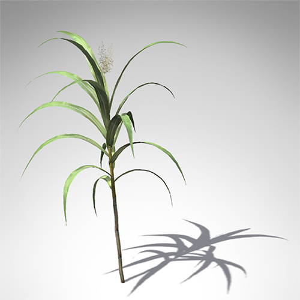

### Introduction

#### Background
First introduced into Louisiana in 1751, sugarcane (_Saccharum officinarum_) is the highest valued row-crop in the state. 
Its continuous production is an important historic and economic component of Louisiana's overall economy. While recent 
decades have seen a drop in Louisiana sugarcane acreage, crop values have remained stable due to increases in sucrose 
yield. Significant increases in yield are attributable to the addition of nitrogen (N) fertilizer.

###### Figure 1.  Saccharum officinarum (Sugar Cane).

#### Problem
As gross tonnage of harvested sugarcane declines, sugarcane farmers in Louisiana are under pressure to boost operational 
efficiency in order to sustain this economically vital crop. It is essential that producers apply new and proven technology 
in order to mitigate the cost of production, maximize yield, and limit impact on the environment.

#### Current Methods
Intensive agricultural production systems, such as sugarcane, typically require higher nitrogen (N) rates to achieve 
sufficient biomass and yield. Along with N rate optimization, N application timing is also an important consideration. 
Development of effective and affordable N management systems is essential to maintain sustainable sugarcane agriculture 
in Louisiana, both from an economic and environmental perspective.

#### Study Goals
Methods currently employed to determine crop N status in sugarcane include visual inspection, tissue analysis, and 
chlorophyll meters. Soil N analysis is also utilized to gauge N soil content, but the reliability of soil sampling 
techniques is inconclusive due to challenges associated with the nature of soil N - especially in the humid alluvial 
soils of southern Louisiana.

#### The Value of Spectral Indices
The Normative Difference Vegetation Index (NDVI) is a form of hyper-spectral imaging that collects and processes 
information across specific wavelengths of the electromagnetic spectrum. The purpose of NDVI image processing is to 
obtain a spectral index of each pixel in an image. In agriculture, the goal of NDVI imaging is to detect the relative 
strength of photosynthetic processes in each area of a field. Hyper-spectral methods such as NDVI have the main advantage 
that the entire spectrum may be acquired at every point without prior knowledge of the sample; post-processing allows all 
information in the dataset to be mined in any number of ways after the fact. The primary disadvantage of traditional 
methods is their cost and complexity.

#### Access to Technology
Studies on Louisiana sugarcane growth have shown that remote sensing methods like NDVI are effective in predicting sucrose 
yield in response to applied N fertilizer. Yet access to these technologies by farmers is limited; acquiring, processing 
and interpreting such data is costly and time-consuming. While high resolution aerial imagery such as NDVI holds the 
potential to improve operational efficiency, economic factors prevent their general adoption by Louisiana farmers.

High temporal and spatial resolution NDVI can provide a host of potential uses in agriculture: prescribing N fertilizer 
amounts and estimating crop yield are two of the potential benefits to Louisiana sugarcane producers. Yet a 'chicken and egg' 
problem exists in allocating time and resources necessary for technology that has yet to be been proven in the field. Our 
study intends to make these tools available, in order to refine and measure their effectiveness.

#### What Follows

This report is organized into twelve sections. In provides in varying levels of detail both background and 
results from a two-year study on the feasibility of using different multi-spectral indices to predict sucrose yield 
in sugar cane. Sugar has a longer season than most other crops. It is planted anywhere between August and March 
depending on the variety and age of the cultivar. From the time of planting, a first year 'plant cane' cultivar such as 
was used in this study will be harvested 12-14 months later. 

1. __Introduction__
    * This documemt.
2. [__Through the Eyes of a Plant__](how_plants_see.md)
    * A gentle introduction to the biology of plant life ...
3. [__Kites, Balloons, and Drones__](kites_balloons_drones.md)
    * A description of various aerial options available at low-cost ...
4. [__Study Methods__](study_methods.md)
    * An overview of some of the approaches considered by this study ...
5. [__Varieties of Spectral Index__](spectral_indices.md)
    * An in-depth look at the types of vegetation index used in this study ...
6. [__Pre-Processing Steps__](pre_processing_steps.md)
    * How we prepared the image data for analysis ...
7. [__Post-Processing Steps__](pre_processing_steps.md)
    * Analyzing the image data ...
8. [__Study Results I - Balloons and Kites__](study_results_balloons.md)
    * Expected results when using  balloons and kites...
9. [__Study Results II - Aerial Drones__](study_results_drones.md)
    * Results when using drones ...
10. [__Summary__](summary.md)
    * Summary of our results ...
11. [__Closing Remarks__](final_notes.md)
    * What we've learned thus far ...
12. [__References__](summary.md)
    * Lorem ipsum dolor sit amet ...

### Acknowledgements
This work was funded by grant generously provided by the __Sustainable Agriculture Research & Education__ program at USDA 
(known as SARE). SARE is the primary USDA grant and outreach provider program for farmers, researchers and educators who seek 
to develop innovations that improve farm profitability while protecting water and land, and revitalizing communities. 
This work was made possible through a SARE Producer Grant. 

The goal of the ARE Producer Grant program is to allow working farmers an opportunity to conduct projects that solve challenges 
develop information on what works and doesn’t work. A core mission is to provide information to other farmers 
who may be facing similar challenges who cmight benefit from the results of the funded project.

###### References
[1] Image source: [Wikipedia](https://commons.wikimedia.org/wiki/File:Saccharum_officinarum_-_K%C3%B6hler%E2%80%93s_Medizinal-Pflanzen-125.jpg)

 
