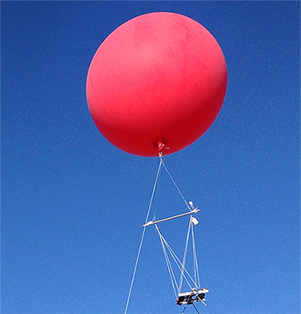

### 4 - Kites, Balloons, and Drones

#### Introduction
* The goal in aerial data capture is to produce consistent, stable images.
* Cameras in flight are inherently unstable.

The history of taking photos from high-flying objects is long and storied, involving blimps, balloons, parachutes, kites, pigeons and personal drones. All these and more have been set aloft with ingenious cameras attached and tools to trigger them either remotely or automatically. The French caricaturist Gaspard-Félix Tournachon (known as ‘Nadar’) was first to fly and photograph the city of Paris from above in 1858.

###### Figure 1. Gaspard-Félix Tournachon hangs on, makes history. 

Whatever method is used the object remains the same: position the camera at sufficient height, point it downward (as close to nadir as possible), get the shots, return the rig safely to the ground. None of the methods discussed in our report performed perfectly in all respects considered.

#### Kites
* In certain conditions kites are incredibly stable and will fly for extended periods.
* Kites are easy to understand. Most people have flown one.

The image in __Figure 2__ shows a camera being suspended from a kite using a device known as a Picavet (named for French inventor Pierre Picavet). The Picavet attaches the camera to the line that flies the kite and holds it more or less in place. A Picavet consists of a rigid cross suspended below the kite line from two points.

###### Figure 2. A camera system suspended via Picavet from a Delta-style kite. 

Kites represent an easy and accessible solution to suspending cameras in flight and almost everyone has had some experience 
with them.  Given a strong and stable enough wind, a flying kite may be tied off and will remain suspended in the air for long periods without
attention. On the other hand, while Picavets are capable of orienting the angle 
of a camera roughly down, they don't prevent a camera from being jostled about during flight. In the event of a 
change in speed or wind direction the result may be blurried images mixed in with a few good captures. Another 
consideration is the amount of effort required to retrieve a high-flying kite when it's facing into a stiff wind. For kite flying
a pair of heavy leather gloves is always recommended! 

#### Balloons

* Balloons serve as an alternative to kites on windless days.
* Helium is an expensive and non-renewable resource. 

__Figure 3__ shows a 2-meter wide polyethelene balloon filled with helium gas. It uses a Picavet from which it suspends a dual-camera system similar to the one shown for the kite. The main difference between balloons and kites is in how each flies. Depending on size and payload (i.e. the weight of the camera plus the suspension system) a kite requires a sustained wind to become airborne. During this study our kite rig consisted of a 12′ Delta-style suspending nearly half a pound of camera and triggering gear. Getting this rig into the air required a minimum sustained wind of 8-10 mph. On the other hand a helium balloon is sensitive and will be guided off course by a light wind. On a windless day the balloon rises easily to great altitude and remains steady in place for extended periods.   
 

###### Figure 3. A helium-filled balloon suspends a dual-camera system. 

We have found balloons and kites to be very practical and complimentary tools for aerial photography in agriculture. On windless days a helium balloon performs well while on a blustery one a kite is the better choice. In either case weather is key. The caveat of never putting into the air anything you aren’t prepared to lose holds special meaning with either but especially with a balloon. While a kite will eventually descend, if you lose control of a balloon it will continue ascending and may drift into areas where it doesn’t belong (i.e. into an airport’s flight path).

A more practical concern regarding helium-filled balloons is that the element is in short supply. In some areas of the world helium use is restricted to essential medical and research purposes. Shortage in helium supplies has led to a rise in the cost of this lighter-than-air gas. One should consider this when deciding on helium use for non-critical purposes. While helium is naturally released from fossil-fuel production sites and may be captured and stored, after use it eventually escapes into space forever.

#### Unmanned Aerial Vehicles (i.e. Drones)

* Aerial drones (UAVs) are unique among the other methods discussed.
* UAVs provide stability and reproducibility over individual flights.

A recent development in aerial photography addresses some of the weaknesses found in other methods tried. While a UAV is technically an aircraft without a human pilot in fact all aerial drones rely on human direction. Perhaps it’s more accurate to say that drones act semi-autonomously while being piloted remotely. Either way, they represent a significant improvement over other methods discussed.

Several attributes make UAVs unique among other methods. Chief among these is the ability to receive a pre-programmed flight plan where the height and extent of every mission is reproducible from one flight to the next. As we will see in later sections, this capability is especially important in the context of precision agriculture.

Aerial drone prices have dropped but owning and operating one remains an substantial expense. While a number of turnkey services provide all-in-one flight and data services, as in any new endeavor, understanding the steps involved and the actual value-add is crucial for success.

 

###### Figure 4. A 3DR Solo drone in mid-flight. The Solo was used in this study. 

Here are some ways that aerial drone technology is being applied in agriculture:

* __Soil and Field Analysis__ 
    * UAVs can be used at the start of a crop cycle to produce 3D maps. After planting, 
    soil and field analysis maps can help direct irrigation and nitrogen-application.
*  __Planting__ 
    * Planting systems directed by UAVs can achieve higher uptake rates and lower overall planting costs.
* __Crop Spraying__ 
    * With ranging technologies such as LiDAR drones can be used to apply the correct amount of liquid fertilizer 
    or pesticide to the ground for even coverage. 
* __Crop Monitoring__ 
    * How to scale an effective crop monitoring plan remains an issue for most farmers. 
    Satellite imagery has been used for large-scale crop monitoring but these data can be imprecise and
    are often expensive. Time-series data from successive UAV flights can show the development of a crop much more effectively. 
* __Health Assessment__ 
    * With UAVs it is possible to scan a crop in the visible and near-infrared bands
    and identify which areas are healthy or unhealthy. Vegetation indices can be used to track changes 
    in crop health over time. 
    
The goals of our study limits discussion to the last two categories (i.e. to monitoring and assessment of the health of a crop) however these and other developments like them have created a kind of revolution in agricultural science and practice. When we began this study the autonomous drone was a figment, its use in agriculture was limited and largely theoretical. UAVs were not a viable option unless one had very deep pockets and a background in aviation. Since that time UAVs have quickly evolved and become firmly established as a new norm in agriculture.

#### Summary
Small and large growers alike can benefit from the steep reduction in price and complexity of UAVs and multi-spectral cameras. Using such tools growers can acquire valuable forms of data as required and suit them to their specific needs. In addition to drones and precision cameras we also used kites, balloons, along with single and dual camera systems. Each has its place in agriculture and taken together all represent a leveling force of technology which holds the potential to assist small and medium-sized growers in farming more precisely and sustainably.

#### Next section >> [5 – Varieties of Spectral Index](spectral_indices.md)

### [Table of Contents](abstract.md)
