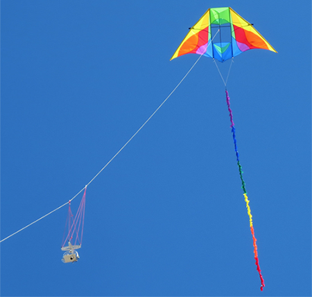

### III - Kites, Balloons, and Drones

#### Aerial Photography
* The goal in aerial data capture is to produce consistent, stable images.
* Cameras in flight are inherently unstable.

The history of taking photos from high-flying objects is long and storied, involving blimps, balloons, 
parachutes, kites, pigeons and personal drones. All these and more have been set aloft with ingenious cameras 
attached and tools to trigger them either remotely or automatically. The French caricaturist Gaspard-Félix Tournachon (known as 'Nadar') 
was first to fly and photograph the city of Paris from above in 1858.

###### Figure 1. Gaspard-Félix Tournachon hangs on, makes history. 

Whatever method is used the object remains the same: position the camera[s] at sufficient height, point 
them down (as close to nadir as possible), get the shot, return safely to the ground. None of the 
methods discussed in our report performs perfectly. 

#### Kites
* Kites are easy to understand.
* In certain conditions kites are incredibly stable and will fly for extended periods.

The image in __Figure 2__ (courtesy of Ron Marcisak) shows a camera being suspended from a kite using a device 
known as a Picavet (named for French inventor Pierre Picavet). The Picavet attaches the camera to the line that flies 
the kite and holds it more or less in place. A Picavet consists of a rigid cross suspended below the kite line from 
two points.

###### Figure 2. A camera system suspended via Picavet from a Delta-style kite. 

Kites represent an easy and accessible solution to suspending cameras in flight and almost everyone has had some experience 
with them.  Given a strong and stable enough wind, a flying kite will remain suspended in the air for long periods without
attention if it is tied off to something. On the other hand, while Picavets are capable of orienting the angle 
of a camera roughly down, they don't prevent cameras from being jostled about during flight. In the event of a 
change in speed or wind direction the result may be many blurried images mixed in with a few good captures. Another 
consideration is the amount of effort required to retrieve a high-flying kite when it's facing a stiff wind. For kite flying
a pair of heavy leather gloves is always recommended. 

#### Balloons

* Balloons serve as an alternative to kites on windless days.
* Helium is an expensive and non-renewable resource. 

__Figure 3__ shows a 2-meter wide polyethelene balloon filled with helium gas. It employs a Picavet system from which it 
suspends a dual-camera system similar to the one shown for the kite. The main difference between balloons and kites is 
in how each flies. Depending on size and payload (i.e. the weight of the camera plus the suspension system) a kite requires 
sustained wind to become airborne. During this study our main rig consisted of a 12' Delta-style kite suspending nearly a 
pound of camera gear and triggering mechanisms. Getting this kite into the air required a minimum sustained wind speed of 8-10 mph. 
On the other hand a helium balloon is sensitive to wind and will be guided quickly off course by even light winds. On a 
windless day a balloon will rise easily to great altitude and remain steady in place for hours.    
 

###### Figure 3. A helium-filled balloon suspends a dual-camera system. 

We have found balloons and kites to be very practical and complimentary tools for aerial photography in agriculture. On windless days
a helium balloon performs well while on a blustery day the kite is a better choice. In either case weather is paramount.
The caveat of never putting into the air anything you aren't prepared to lose holds special meaning with a balloon. 
If you lose control it will continue to ascend and drift possibly into areas where it doesn't belong (i.e. into an airport's flight path). 

A more practical issue regarding helium-filled balloons is that the element itself is in short supply. In some areas of the 
world use of helium is restricted to essential medical and research purposes only. A world-wide shortage of helium 
has led to a sharp rise in cost for this light-than-air gas. One should rightly consider this when deciding on helium 
use for non-critical purposes. Helium is naturally released from fossil fuel production sites and may be captured 
and stored. However, after use it's not easily re-captured but ultimately escapes into space forever. 

#### Unmanned Aerial Vehicles (i.e. Drones)

* Aerial drones (UAVs) are unique among the other methods discussed.
* UAVs provide stability and reproducibility over individual flights.

A recent development in aerial photography addresses some of the weaknesses found in other methods. While a UAV is 
technically an aircraft without a human pilot in fact all aerial drones rely on human direction. Perhaps 
it's more accurate to say that drones act semi-autonomously while being piloted remotely. Either way, they represent a 
significant improvement over other methods discussed in agriculture.

Several key attributes make UAVs unique among the other methods. Chief among these is the ability to receive a pre-programmed 
flight plan where the height and extent of every flight is reproducible from one flight to the next. As we will see in 
later sections, this capability is especially important in the context of agriculture. 

Aerial drone prices have dropped in recent years but owning and operating one remains an substantial 
expense. While a number of turnkey services provide all-in-one flight and data services, as in any new endeavor, 
understanding the steps involved and the actual value-add is crucial for success.  

###### Figure 4. A 3DR Solo drone in mid-flight. The Solo was used in this study. 

Here are some ways that aerial drone technology is being applied in agriculture:

* __Soil and Field Analysis__ 
    * UAVs can be used at the start of a crop cycle to produce 3D maps. After planting, 
    soil and field analysis maps can help direct irrigation and nitrogen-application.
*  __Planting__ 
    * Planting systems directed by UAVs can achieve higher uptake rates and lower overall planting costs.
* __Crop Spraying__ 
    * With ranging technologies such as LiDAR drones can be used to apply the correct amount of liquid fertilizer 
    or pesticide to the ground for even coverage. 
* __Crop Monitoring__ 
    * How to scale an effective crop monitoring plan remains an issue for most farmers. 
    Satellite imagery has been used for large-scale crop monitoring but these data can be imprecise and
    are often expensive. Time-series data from successive UAV flights can show the development of a crop much more effectively. 
* __Health Assessment__ 
    * With UAVs it is possible to scan a crop in the visible and near-infrared bands
    and identify which areas are healthy or unhealthy. Vegetation indices can be used to track changes 
    in crop health over time. 
    
While the goals of our study necessarily limits discussion to the last two categories (i.e. monitoring and 
assessment of the health of a crop) these and other efforts like them have created a kind of revolution in agricultural
practice. When we began our study the autonomous drone was not an option unless one had very deep pockets and a 
background in aviation. Two years ago their use was limited and largely theoretical. Since then UAVs have quickly evolved 
and become firmly established as a new norm in agriculture.   

[Bottom line is kites, balloons, single or dual camera systems are good for some things not good 
for others.]

#### Summary
Of all aerial methods discussed thus far UAVs prove to be the most capable in that they allow...
Small and large growers alike may benefit from the steep reduction in price and complexity of these wondrous devices. 
Using these tools growers can farm more economically and acquire the most valuable forms of data as need and suited to their
specific needs.  

###### References

[TBD]

* History of Aerial Photography Professional Aerial Photographers Association (retrieved 5 October 2016)
* https://en.wikipedia.org/wiki/Nadar
* Ron Marcisak https://www.flickr.com/photos/ronskap/13173764143/in/pool-kaprigs/
* Alan McConchie https://www.flickr.com/photos/almccon/
* Sam Pepple, Sample Cartography (stiched map image)
* Chris Fastie, Courtesy of the [Public Lab](https://publiclab.org/).

 
