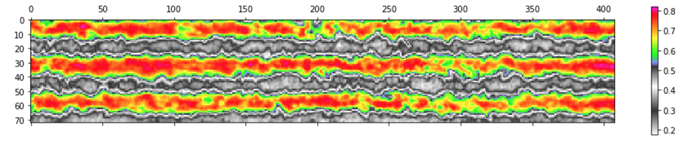

### Post-Processing Spectral Imagery

#### Introduction

This section describes in detail some tools and methods used to generate and interpret 
statistics from multi-spectral indices. These and other post-processing steps have formed a large 
part of our exploration of available methods for understanding the relationship between a given spectral index and 
the final sucrose yield in sugar cane.

While a number of technical details are discussed we hope to present them in a manner that remains
accessible to non-technical users. A primary goal of this study is to provide information and access to methods 
for working farmers, not technical people. Of course there will always be specialized knowledge and one cannot
be expected to know all of it. Still, much of this work is accessible, more so than might appear on first blush.
It's an under-appreciated fact that growers are, as a rule, quite adept at picking up a new technology. 
Often they have had to be. 

#### Open Source Automation Tools

* A range of open source tools is available to assist in processing multi-spectral imagery. 
* Automation of the processing steps is both possible and desirable using open source tools.
* In this way one may achieve, at reasonable cost, a level of sophistication once beyond reach.

[Appendix I]() describes a number of software tools and libraries that are available as open source
projects. Among other things this means that installing, learning and using them is open to anyone who has an 
interest. In the context of this project all tools described have been applied during the study and new code continues to be 
added on a daily basis [here](). Our project draws on the strength of these open-source tools in order to implement various 
processing steps. In fact, even the drone used in this study runs a stripped-down version of the 
open-source Linux operating system, i.e. one may login, get a command prompt, and execute code on the drone. And we do! 

In any part of a multi-step process looms the spectre of error. This is especially true if the process relies on 
manual execution of a number of steps. In every phase of this project we have sought to minimize error by __automating__ as much of the work as possible.   
  
#### Post-Processing Steps

The automated system designed for the project consists of six steps. The first four are required to prepare the raw image 
data prior to analysis. The fifth and sixth are post-processing steps that are performed subsequently. In this section we 
consider steps five and six. 

1. Mosaicking
2. Atmospheric correction
3. Geometric correction
4. Image co-registration
5. __Masking__
6. __Extraction of image-derived statistics.__

#### Practical Examples

* Seasonal variation in spectral data can be addressed through basic machine learning techniques.
* Different spectral indices offer alternate views of the same data. 
* Consideration of proprietary versus open-source models. 

We tested a variety of spectral index types during this study, always with the goal of discovering which was best suited 
to the task of revealing an often elusive set of values.

One question we sought to answer was how interaction of NIR light with soil effects the spectral index
of an early sugar cane crop. __Figure 1__ shows a pair of early season NDVI images, one taken in late April 
and one from late May. Nitrogen treatments for this crop occurred on April 19, 2017. The two images 
are significant insofar as they potentially reveal the initial response to treatment and the sensitivity of a specific 
index type in capturing it. Each image is an NDVI of the same section over time following application of 80 lbs N per hectare. 
The first was taken 6 days after N application and serves as a baseline. The second is
one month later in the season. 

It turns out that this is a typical sort of task in post-processing spectral data. We want to analyze image pairs in 
order to derive a better sense of the sensitivity of a particular index, and to correlate the average index values of each 
pair. However, at least half of the visible area in these images of early sugar cane is composed of __soil__ which should not 
be included in the averaged NDVI value (e.g. since soil is _not_ photosynthetic).

###### Figure 1. Comparison of NDVI images. 

Thus the task is to remove pixels from an image where those pixel values represent soil. How might one accomplish this? 
One way is to open up each image in an editor, examine every pixel and guess, based on color, whether it should be 
included in the final average or not. Each of these particular section images contains ~30,000 pixels and there are 30 
sections in each dataset. That's roughly 900,000 pixel decisions to make for each.  

###### Figure 2. Histogram of uncorrected NDVI values.

Instead of counting pixels, another approach is to look more closely at how the two images stack-up. To do this we 
can plot them as 'dual' histograms, as is done in __Figure 2__. Note that there are multiple peaks in each histogram (one 
is colored yellow and the other purple). The yellow peak at far left is most prominent. This peak indicates that 
'soil' pixels have an average NDVI value between 0.1 and 0.2. There are also peaks found in the purple histogram, 
corresponding to NDVI values from the 05/25 image, though these are not as prominent as the 04/25 image.      

Examining the histogram of 'uncorrected' NDVI values in __Figure 2__ we see that the mean NDVI value for 04/25 and 05/25 is 
0.26 and 0.52, respectively. These averages include the soil pixel values in addition to the plant material values. We can 
use the same data that generates this histogram as input into a type of 'classification' machine learning algorithm known
as a __minimum threshold__. This algorithm assumes that the image contains two pixel classes (foreground and background) which 
are used to calculate an optimum threshold to separate the two. In plain English this means that by applying the algorithm 
we're automatically masked the more prevalent pixel value (in this case the non-photosynthetic parts) in a manner that is repeatable, 
i.e. it is not based solely on one individual's personal judgement.        

###### Figure 4. Histogram of 'corrected' NDVI values.

The result of applying minimum threshold is seen in a second set of images and in a histogram generated from the 
'thresholded' data (see __Figure 3__). No longer do we see the prominent peaks (the 'soil' pixels are replaced 
by 'neutral' white). The second set of averages more accurately reflects the actual NDVI values of the 
crop, minus the noise. These values (in the 'corrected' versions for 04/25 and 05/25) are 0.42 and 0.65, respectively.

###### Figure 4. Set of uncorrected and corrected NDVI images.

This straightforward use of machine learning serves to illustrate how automating a single step in the 
process chain reduces error. __Figure 4__ shows a set of three uncorrected/corrected NDVI images from May 25, 2017. The nitrogen treatments are, from left 
to right, 40 lbs N, 60 lbs N and 80lbs N. In the top row the unbiased standard deviations are 0.17, 0.17, and 0.18, 
respectively, while in the corrected versions they are 0.9 across. In this case we've managed to remove some of the 'noise' 
from the samples which proves to be of significance when a final interpretation of these data is made.  

#### Section III

* Early versus late crop interpretation
* Lorem ipsum dolor sit amet
* Lorem ipsum dolor sit amet

###### References

 