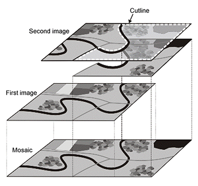
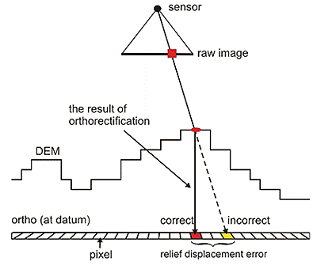

### Pre-Processing Spectral Imagery

#### Introduction

This section describes various software tools and methodologies used to take raw captured images 
and transform them into a multi-spectral index suitable for statistical analysis.  

A central issue in the capture and transformation of large volumes of digital ...

#### Pre-Processing Steps

* Defining the initial processing steps. 
* On site management of digital assets. 
* Quality control and reproducibility. 

The automated system designed for this project performs six processing steps in total. The first four are required to 
prepare the raw image data before it may be analyzed. The fifth and sixth are post-processing steps that are 
considered in a subsequent section [here]().

1. __Mosaicking__
2. __Atmospheric correction__
3. __Geometric correction__
4. __Image registration__ 
5. Masking
6. Extraction of image-derived statistics

While proprietary software exists ([here](arcgis) and [here](pix4d)) and has been used to implement the steps listed above, 
the expense of licensing and training for their use is often prohibitive. The increased capability of open-source software 
to process multi-spectral data presents a great opportunity for individuals and small teams to develop workflows 
for image processing that can be adapted to specific purposes for little or no cost when the need arises. 

#### Mosaicking

Mosaicking is the process of taking two or more raster datasets (i.e. images) and combining them into a single, seamless image. 
Mosaicking can be accomplished using open-source applications such as QGIS, GDAL, or the Orfeo Toolbox. For our case several 
scripts based on GDAL were developed to  accomplish a number of tasks, such as extracting metadata from 
uploaded images, managing cases where overlapped image pixels conflicted, or managing the coordinate system.   

__Figure 1.__ Example of a photo-mosiac. 

#### Atmospheric Corrections

Because the atmosphere intervenes between sun and ground it can distort the spectral distribution of light as it impinges upon 
the Earth. In the past, acquisition of spectral imagery was mainly limited to that acquired from aircraft or satellite, 
where the intervening distances are much greater. A key advantage of drones is that they fly close to their targets and 
thus atmospheric effects are minimized. 

Unfortunately, an atmospheric effect that cannot be mitigated with a drone is partial occlusion of light due to 
cloud cover. This happens not as one might expect, when there is consistent coverage, but rather where there's a 
patch of meandering cumulus passing in and out of the camera's frame. In this circumstance the delicate balance of calibration
so critical to getting consistent results from one shot to the next is lost. An otherwise perfect day's flight can be 
compromised by a single pesky cloud. 

#### Geometric Corrections

When aerial images are used in agriculture every feature of every image must accurately represent a true and consistent 
position on the ground. For purposes of this study the requirement carries weight since the tolerance for error is 
rather low. Achieving this level of precision requires both planimetric consistency (in the x,y orientation) as well as 
height invariance (in the z orientation). The high bar on stability is required since each location in an image 
must be translated into a standard geographical coordinate system representing the Earth's surface. 

Aerial photography in the flat, alluvial deltas of southern Louisiana enjoys the benefit of relative stability in the 'Z' 
orientation. Here there are no sloping hills to compensate for. In other situations ortho-rectification is critical where changing
elevation can skew the accurate position of a point captured by the camera with its corresponding point on the ground. Nevertheless, geo-rectification of images is required and is facilitated through use of ground control 
points (GCPs). Geo-rectification is the process of transforming an image and a map onto a common coordinate system. [fn]

In addition, ortho-rectification is required to correct for image distortion arising from anomalies in the nadir positioning 
of the camera. Each time a drone doubles-back in flight to cover another section it loses nadir (its perpendicular aspect) 
with respect to the ground. It may also lose nadir at any point in the flight on a windy day. In either case, the necessary 
geometric corrections were performed using scripts that make use of GDAL functionality.        
  

__Figure 2.__  Orthorectification using a digital elevation model (DEM). 

#### Image Co-Registration

One goal in our study was to consider the evolution of a spectral index over time as a means of making predictions about yield.
When the intention is to study two or more images of a time series then image co-registration is required. Co-registration 
ensures that an image captured one day will be spatially-aligned with an image of the same extent captured on another day. 
We were able to meet these criteria through use of GCPs and by having an area dedicated exclusively for the purposes of our 
study during the entire period.  

Another scenario where co-registration issues arise is when more than a single camera lens is used to capture images of the 
same object. Both the modified consumer camera and the Sequoia camera use multiple lens. In a workflow defined for the Sequoia 
camera we performed 'band-to-band' image alignment (a form or co-registration) in order to account for the distortion effects 
of multiple lens. 

#### Summary

Very little man-made infrastructure was present in our study area thus the images generated throughout were dependent 
for their alignment on invariant structures occupying known positions in the field. In addition, we set up ground 
control points based on known latitude and longitude coordinates and on elevations. There was a very mild down-slope from one
 end of our study area to the other of about 0.5 meters Often these landmarks were unnecessary
since part of the study objective 

###### References

Image references: 1, 2 http://www.pcigeomatics.com/