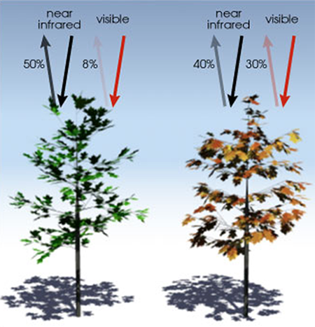

###### Calculating a Vegetation Index

A vegetation index is a ratio of two or more narrow bands of light. Calculating a vegetation index over an image requires 
first converting that image to a *raster* - a rectangular grid of pixels or points of color. Each pixel contains values 
which correspond to the captured bands of light. In familiar RGB terms each pixel contains a Red, a Green and a Blue 
luminosity value. Such scores infer the reflectance value by recording the luminosity of electromagnetic radiation coming 
into contact with pixel sensors in that band of light.   

To calculate NDVI from an image we do the following: 
1. Subtract the NIR band (reflectance values) in each pixel from all Red values. 
2. Add all NIR values in each pixel to all Red values.
3. Calculate the ratio between the calculated difference (in the numerator) and the calculated sum (in the denominator). 

    _3._
    
Thus, an NDVI index is simply a ratio of the difference and the sum of two narrow bands of light. A ratio is taken in order to 
*normalize* the values with the effect that this binds them between -1 and 1. Plant NDVI values can range from 0 to 1 but 
usually lie somewhere between 0.2 and 0.8.

###### Generating NDVI (and other spectral indices)

Thus far we've discussed simple calculations applied to single image pixels. In practice, generating a vegetative index
over an entire field or crop involves more effort. For example, in order to calculate NDVI over a captured image, one must 
first create and manipulate two separate images (pixel grids) each containing light from a separate bands or wavelengths.
Thus, the NIR band is contained in one layer while the red is held in another. Manipulating each pixel, of each layer, 
according to a mathematical expression, produces a third layer which is the NDVI image itself. 

 _4._
 
In addition to analyzing many pixels we need a way to efficiently separate individual bands of light as arrays.
In order to provide actionable information to farmers we'll need to scale these sorts of manipulations up to potentially 
__millions and millions__ of pixels covering __hundreds and hundreds__ of megabytes of image data.

 
 _5._

JPEG-compressed and white-balanced prior to capture according to a methodology which will be fully reported.  
We will describe elsewhere the importance of calibration in NDVI photography along 

All indices are “normalized” by measuring sun energy for each measurement, taking into account sun angle and cloud cover.  
This allows “apples-to-apples” comparison throughout the season, and season-to-season.

Yet acquisition and interpretation 
of these data using traditional methods is expensive, error prone, and often beyond reach of most Louisiana sugar cane growers.

Center wavelength and bandwidth specs for the Sequoia camera are: 

| Band Name | Center Wavelength (nm) | Bandwidth (nm) |
|-----------|:----------------------:|:--------------:|
| Green     |           550          |       40       |
| Red       |           660          |       40       |
| Red Edge  |           735          |       10       |
| Near IR   |           790          |       40       |

 
###### Figure 1. Mechanics of light absorption in plants