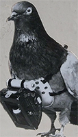

###### Calculating a Vegetation Index

A vegetation index is a ratio of two or more narrow bands of light. Calculating a vegetation index over an image requires 
first converting that image to a *raster* - a rectangular grid of pixels or points of color. Each pixel contains values 
which correspond to the captured bands of light. In familiar RGB terms each pixel contains a Red, a Green and a Blue 
luminosity value. Such scores infer the reflectance value by recording the luminosity of electromagnetic radiation coming 
into contact with pixel sensors in that band of light.   

To calculate NDVI from an image we do the following: 
1. Subtract the NIR band (reflectance values) in each pixel from all Red values. 
2. Add all NIR values in each pixel to all Red values.
3. Calculate the ratio between the calculated difference (in the numerator) and the calculated sum (in the denominator). 

    _3._
    
Thus, an NDVI index is simply a ratio of the difference and the sum of two narrow bands of light. A ratio is taken in order to 
*normalize* the values with the effect that this binds them between -1 and 1. Plant NDVI values can range from 0 to 1 but 
usually lie somewhere between 0.2 and 0.8.

###### Generating NDVI (and other spectral indices)

Thus far we've discussed simple calculations applied to single image pixels. In practice, generating a vegetative index
over an entire field or crop involves more effort. For example, in order to calculate NDVI over a captured image, one must 
first create and manipulate two separate images (pixel grids) each containing light from a separate bands or wavelengths.
Thus, the NIR band is contained in one layer while the red is held in another. Manipulating each pixel, of each layer, 
according to a mathematical expression, produces a third layer which is the NDVI image itself. 

 _4._
 
In addition to analyzing many pixels we need a way to efficiently separate individual bands of light as arrays.
In order to provide actionable information to farmers we'll need to scale these sorts of manipulations up to potentially 
__millions and millions__ of pixels covering __hundreds and hundreds__ of megabytes of image data.

 
 _5._

JPEG-compressed and white-balanced prior to capture according to a methodology which will be fully reported.  
We will describe elsewhere the importance of calibration in NDVI photography along 

All indices are “normalized” by measuring sun energy for each measurement, taking into account sun angle and cloud cover.  
This allows “apples-to-apples” comparison throughout the season, and season-to-season.

Yet acquisition and interpretation 
of these data using traditional methods is expensive, error prone, and often beyond reach of most Louisiana sugar cane growers.

Center wavelength and bandwidth specs for the Sequoia camera are: 

| Band Name | Center Wavelength (nm) | Bandwidth (nm) |
|-----------|:----------------------:|:--------------:|
| Green     |           550          |       40       |
| Red       |           660          |       40       |
| Red Edge  |           735          |       10       |
| Near IR   |           790          |       40       |

 
###### Figure 1. Mechanics of light absorption in plants

Throughout this study 
our objective has been to test the viability of low-cost methods for acquiring and processing aerial multi-spectral data. 

Creating a useful spectral index requires working knowledge of a host of input variables along with 
understanding of the external environment. Vegetation indices intend to extract reflected light from 
plants but in practice many other variables, soil moisture content, solar angle, camera sensitivity, and orientation,  alter the final index value. The age of a crop itself - i.e. its 'architectural' 
characteristic - can influence an index value.

#### Image Resolution

Lorem ipsum dolor sit amet, consectetur adipiscing elit, sed do eiusmod tempor incididunt ut labore et dolore magna aliqua. Ut enim ad minim veniam, quis nostrud exercitation ullamco laboris nisi ut aliquip ex ea commodo consequat.

To estimate future crop performance using remote sensing data one must ascertain the relationship between sugarcane's specific 
spectral signature and its yield. 

#### Qualitative versus Quantitative Science.

Qualitative Research is primarily exploratory research. It is used to gain an understanding of underlying reasons, opinions, and motivations. It provides insights into the problem or helps to develop ideas or hypotheses for potential quantitative research. Qualitative Research is also used to uncover trends in thought and opinions, and dive deeper into the problem. Qualitative data collection methods vary using unstructured or semi-structured techniques. Some common methods include focus groups (group discussions), individual interviews, and participation/observations. The sample size is typically small, and respondents are selected to fulfil a given quota.

Quantitative Research is used to quantify the problem by way of generating numerical data or data that can be transformed into usable statistics. It is used to quantify attitudes, opinions, behaviors, and other defined variables – and generalize results from a larger sample population. Quantitative Research uses measurable data to formulate facts and uncover patterns in research. Quantitative data collection methods are much more structured than Qualitative data collection methods. Quantitative data collection methods include various forms of surveys – online surveys, paper surveys, mobile surveys and kiosk surveys, face-to-face interviews, telephone interviews, longitudinal studies, website interceptors, online polls, and systematic observations.

Estimating yield is a major challenge for the majority of agricultural crops. 

NDVI is a popular vegetation index which has been shown to be effective in predicting crop yield potentials in other plant species. But what is a multi-spectral vegetation index? An example may help to clarify.

The mathematical expression used to create an NDVI index is as follows:

(NIR - Red) / (NIR + Red) = NDVI

This simple expression says "subtract the red band of light from the NIR band (in the numerator), add the same red band to the NIR (in the denominator), find the quotient between the two." Assume that the amount of visible red light reflected from a plant is 8% and the amount of NIR reflected from the same plant is 50%. In this case we'd have the following NDVI expression:

(0.5 - 0.08)/(0.5 + 0.08) = 0.42/0.58 = 0.72

An NDVI value of 0.72 (on a scale of 0 to 1.0) indicates that the plant is doing well. It's reflecting 8% of the red light away while absorbing the remaining 92% for photosynthesis. It's also reflecting more than half of the harmful NIR light away. This is a generic pattern that we can use: higher NDVI values correlate with healthier, more productive plants. Consider the same equation applied to a different plant:

(0.4 - 0.3)/(0.4 + 0.3) = 0.1/0.7 = 0.14

Compared with the healthy plant, this one is doing poorly. It's absorbing more than half of the NIR light while reflecting away a good portion of the red light. Recall that plants use red light to power photosynthesis while NIR light presents a physiological burden to them. This is another generic spectral pattern that we can use: lower NDVI values correlate with unhealthy, distressed plants.

Figure 1. Basic plant physiology supports the generation of a vegetation index.