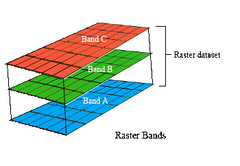

### Varieties of Spectral Index

#### What's A Vegetation Index?

* A multi-spectral index is a mathematical expression relating two bands of light energy reflecting from an 
object.
* Narrow bands of light reflect from particular objects in distinctive ways.

There are a [hundred different ways](https://www.indexdatabase.de/db/i.php) to create a spectral index, all sharing the 
common property of representing a *ratio*, where bands of light serve in the numerator or denominator of a simple mathematical 
expression. A Vegetation Index (VI) is just a spectral index applied to vegetation. Generating and interpreting VIs provides 
a reliable way to compare a plant's photosynthetic activity and structural variation over space and time. __[fn]__ A very 
common spectral index used in agriculture for gauging the health of plants is an index known as 
[NDVI](https://en.wikipedia.org/wiki/Normalized_difference_vegetation_index) ('Normalized Difference Vegetation Index'.) 

 
#### Calculating a Vegetation Index

Calculating a VI requires conversion of an image or set of images into a set of  *rasters* - rectangular grids of 
pixels or points of color. Each pixel contains a set of values corresponding to the captured bands of light. In familiar RGB 
terms each pixel contains a Red, a Green and a Blue score. Such scores reflect the power, or luminosity, of electromagnetic 
radiation for that particular band as it comes into contact with the pixel sensors of a digital camera. Most of the indices 
used in this study make use of an inverse relationship between red and near infra-red reflectance values commonly associated 
with healthy green vegetation. 

###### Figure 1. Raster arrays representing different bands of light.  

To calculate NDVI from an image we do the following: 
1. Subtract the NIR band reflectance values in all pixels from all the Red values. 
2. Add all NIR values in each pixel to all the Red values.
3. Calculate the ratio between the calculated difference (in the numerator) and the calculated sum (in the denominator). 

Calculating NDVI requires first creating and manipulating two separate images (pixel arrays) 
each of which contains light from a separate wavelength. The NIR band is contained in one layer while the red 
is held in another. Manipulating each pixel, of each layer, according to a mathematical expression, produces a third raster 
layer which is the NDVI image itself. All of this is accomplished using software designed to perform matrix arithmetic over
large arrays.  
    
An NDVI index is simply a ratio of the difference and the sum of two narrow bands of light. A ratio is taken in order to 
*normalize* the values with the effect that this binds them between -1 and 1. Plant NDVI values can range from 0 to 1 but 
usually lie somewhere between 0.2 and 0.8. [fn]

Some common vegetation indices explored during our study:

1. __NDVI__ = (NIR - RED) / (NIR + RED)
    * The workhorse of vegetation indices. NDVI reveals the physical basis of most other VI's i.e. the relationship 
    between absorbed/reflected amounts of red and NIR light. In our study, NDVI was best at revealing biomass differences. 
    We found it to be most effective in the early to mid-growth part of the season. It tended to lose some sensitivity 
    following canopy closure. 

2. __SAVI__ = (NIR - RED) /  (NIR + RED + L) * (1 * L)
    * The soil-adjusted vegetation index (SAVI) is a modification of NDVI intended to correct for soil brightness. 
In areas where soil is exposed, reflectance of light is altered in the red and NIR bands and this can 
influence the result. The issue may be present during the early part of the growth season. We addressed 
this sort of issue by use of a masking technique discussed in [Section 9](readme_resources/study_results_drones.md). 
    
3. __OSAVI__ = (NIR - RED) /  (NIR + RED + 0.16)

    *   OSAVI is derived from the Soil Adjusted Vegetation Index (SAVI) above. It's sensitive to canopy density but not
    soil brightness. Where vegetation cover is > 50% it can help dampen the saturation effect that NDVI is prone to.
    We used this index in the latter part of the 2017 season with mixed results. 

4. __NDRE__ = (NIR - RE) / (NIR + RE)
    * NDRE is available only in cameras that are sensitive to the 'Red Edge' band of spectral light. It's a better 
    general indicator of plant health for mid to late season growth when compared to NDVI. NDRE is also thought to be 
    capable of mapping variability in foliar Nitrogen levels, which we were interested in. Green and red-edge bands 
    penetrate the leafy part of the plant more so than the blue or red bands. Thus red-edge is more sensitive to 
    chlorophyll content and to nitrogen contained in the leaf. We used this index extensively. 

5. __GNDVI__ = (NIR - Green) / (NIR + Green)
    * As indicated by the name, the Green Normalized Difference Vegetation Index is related to NDVI (or RNDVI) in that 
    it uses the green band where NDVI uses the red. GNDVI is an index of 'greenness' and by that measure it is more 
    sensitive to photosynthetic activity, specifically to the variation of chlorophyll content in plants.

#### Summary
Thus far we've discussed simple calculations applied to single image pixels. In practice, generating a vegetative index
over an entire field or crop involves much more effort. In addition to separate individual bands of light as arrays we 
need to scale these sorts of manipulations up to potentially __millions and millions__ of pixels covering __hundreds 
and hundreds__ of megabytes of image data.

In coming sections we'll discuss how to achieve this degree of scaling along with strategies for interpreting 
various vegetation indices under differing environmental conditions. Luckily, open-source software and image processing 
tools exist to make these tasks accessible to the average user.

###### References
###### Pinter, Jr., Paul J.; Hatfield, Jerry L.; Schepers, James S.; Barnes, Edward M.; Moran, M. Susan; Daughtry, Craig S.T.; Upchurch, Dan R. (2003). "Remote Sensing for Crop Management". Photogrammetric Engineering & Remote Sensing. 69 (6): 647–664. doi:10.14358/PERS.69.6.647. ISSN 0099-1112.
###### Gitelson, A., and M. Merzlyak. "Remote Sensing of Chlorophyll Concentration in Higher Plant Leaves." Advances in Space Research 22 (1998): 689-692.

 