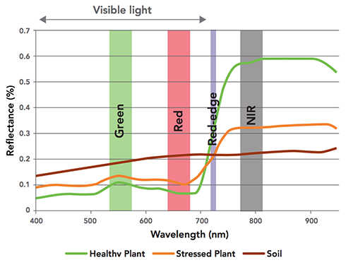
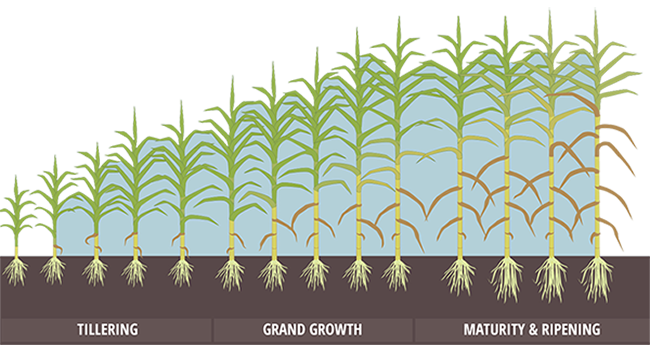

### 5 - Varieties of Spectral Index

#### What's A Vegetation Index?

* A multi-spectral index is an expression relating bands of light as they reflect from an object.
* Narrow bands of light energy reflect from plants and inanimate objects in distinct ways.

There are a [hundred different ways](https://www.indexdatabase.de/db/i.php) to create a spectral index, all sharing the 
property of representing a *ratio* where bands of light are manipulated in the numerator or denominator of a simple mathematical 
expression. Generating and interpreting a vegetation index (a spectral index applied to vegetation) provides 
a reliable way to compare a plant's photosynthetic activity and structural variation over time and space. A 
common spectral index used in agriculture for gauging the health of plants is 
[NDVI](https://en.wikipedia.org/wiki/Normalized_difference_vegetation_index) ('Normalized Difference Vegetation Index'.) 

 
#### Calculating a Vegetation Index

Calculating a VI requires converting an image or set of images into a set of  *rasters* - rectangular grids of pixels or 
points of color. Each pixel contains a set of values corresponding to the captured bands of light. In familiar RGB 
terms each pixel contains a Red, a Green and a Blue score. Such scores reflect the power, or luminosity, of electromagnetic 
radiation for that particular band as it comes into contact with the sensors of a digital camera. Most of the indices 
used in this study make use of an inverse relationship between red and near infra-red reflectance values commonly associated 
with healthy green vegetation. 

###### Figure 1. Raster arrays representing different bands of light.  

An example vegetation index is NDVI which is calculated from an image in the following way: 
1. Subtract the NIR band reflectance values in all pixels from all the Red values. 
2. Add all NIR values in each pixel to all the Red values.
3. Calculate the ratio between the calculated difference (the numerator) and the calculated sum (the denominator). 

Performing the above calculations creates a third pixel value for every input pixel. 

Calculating NDVI requires creating and manipulating separate images (i.e. pixel arrays) one of which contains light 
from the red band and the other from the NIR band. The index is a ratio of differences and sums of these two narrow bands 
calculated separately over many individual pixel points. A ratio is taken in order to _normalize_ values with the effect 
that this binds them between -1 and 1. Plant NDVI values can range from 0 to 1 but usually lie somewhere between 0.2 and 0.8. 

 
###### Figure 2. Fastie LUT (Look Up Table)

Human eyes cannot see NIR light (or the ratio of differences and sums of NIR and red) thus the final result must be 
'colorized' in some way to have it make visual sense. The image in __Figure 2__ is a color 'LUT' or look up 
table that we use throughout the study to accomplish this. (For those interested in the RGB values used to create this LUT 
they are included in [spectral_lib.py]())

 
###### Figure 3. Scaling up.

The image displayed in __Figure 3__ gives an idea of how coloring each pixel works. A more 
detailed description will come in [Section 7](post_processing_steps.md) and [Section 9](study_results_drones.md). 
Here a portion of a single section showing three rows of early growth sugarcane has been imaged as NDVI and colored 
using the color LUT described above. The range of NDVI values goes from low 'soil' to higher areas of growth. 
An entire section is 412 by 72 pixels (100 x 20 ft) but on the left only a portion of the full section is visible. The middle image shows 
more detail. In the right-most part individual pixels are visible. Each pixel has a ground resolution of 2.7 
centimeters, i.e. each individual pixel corresponds to a ground coverage of 1 square inch. 

In summary, each pixel of the final vegetation index has a value representing a number between 0 and 1 and represents a known
area covering the ground. The strength of the NDVI value is used to infer a physical property, in this case the relative amount of photosynthesis occurring at that specific 
point. NDVI and other index values are 'dimensionless' meaning that the physical values 
from which they originate cancel one another out (when taking the ratio). In other words NDVI and other forms of
vegetation index do not purport to measure a actual physical quantity. At best they only _infer_ one. 

Common vegetation indices that were explored during our study include:

1. __NDVI__ = (NIR - RED) / (NIR + RED)
    * The workhorse of vegetation indices, NDVI reveals the physical basis of most other VI's (i.e. the relationship 
    between absorbed/reflected amounts of red and NIR light). In our study, NDVI was best at revealing biomass differences. 
    It was most effective in the early to mid-growth part of the season. NDVI tended to lose some sensitivity in the later
    season following canopy closure. 

2. __SAVI__ = (NIR - RED) /  (NIR + RED + L) * (1 * L)
    * The soil-adjusted vegetation index (SAVI) is a modification of NDVI intended to correct for soil brightness. 
In areas where soil is exposed reflectance of light is altered in the red and NIR bands and this may 
influence the final result. The issue is mainly present during the early part of the growth season. We addressed 
this through use of a custom masking technique discussed in [Section 7](post_processing_steps.md). 
    
3. __OSAVI__ = (NIR - RED) /  (NIR + RED + 0.16)

    *   OSAVI is derived from the Soil Adjusted Vegetation Index (SAVI) above. It's sensitive to canopy density but not
    to soil brightness. Where vegetation cover is > 50% it may help dampen the saturation effect that NDVI is prone to.
    We used this index in the latter part of the 2017 season with mixed results. 

4. __NDRE__ = (NIR - RE) / (NIR + RE)
    * NDRE is available only in cameras that are sensitive to the 'Red Edge' spectral band. It's a better 
    general indicator of plant health for mid to late season growth when compared to NDVI. NDRE is also thought to be 
    capable of mapping variability in foliar Nitrogen levels, which we were interested in. Green and red-edge bands 
    penetrate the leafy part of the plant more so than the blue or red bands. Thus red-edge is more sensitive to 
    chlorophyll content and to nitrogen contained in the leaf.

5. __GNDVI__ = (NIR - Green) / (NIR + Green)
    * As indicated by the name, the Green Normalized Difference Vegetation Index is related to NDVI (also sometimes called RNDVI) in that 
    it uses the green band while NDVI uses the red. GNDVI is an index of 'greenness' and by that measure is more 
    sensitive to photosynthetic activity, specifically to variation of chlorophyll content in plants.
    
6. __CIR Composite__ (Color Infrared) 
    * Unlike the other values described a CIR Composite is not a true index. Instead of displaying the common RGB bands 
    it combines the NIR, Red, and Green bands such that the NIR is shown as red, the red as green, and the green 
    as blue. This allows the NIR light to be visualized as red. We used CIR composite images extensively.

#### Choosing an Index for Sugarcane
* A healthy plant has a distinct 'spectral signature' based on unique reflectance properties.
* The spectral signature of a sugarcane field is a 'sum' of the total number of individual sugarcane plants.  

The percent reflectance of any feature (i.e. water, sand, sugarcane) on the ground may be plotted to produce a 
__spectral signature__. Differences among spectral signatures can be used to analyze and classify remotely sensed objects. 

As discussed in [Section 2](how_plants_see.md), the spectral signature of sugarcane generally follows that of any other 
leafy green plant - it absorbs 60-85 percent of the incident light minus the green band (most of this is reflected away, 
hence leaves appear green) and minus most of the NIR light. 

 
###### Figure 2. The spectral reflectance characteristics of healthy versus stressed sugarcane.

Like other leafy green plants, sugarcane preferentially absorbs the red band for photosynthesis. In __Figure 2__ all   
spectral lines (except for soil) reveal a characteristic bump in the green band relative to the red wavelength, 
indicating that green light is reflected away. In the right-hand portion of the curve nearly all of the NIR light is 
reflected away. 

Sugarcane's spongy [mesophyll](http://www.els.net/WileyCDA/ElsArticle/refId-a0002081.html) is nearly transparent to infrared radiation thus very little NIR is reflected 
by the outer portion of the leaf. Mesophyll tissue and cavities within the leaf scatter most of the NIR light either upward 
(reflection) or downward (transmission). 

Thus, depending on environmental conditions sugarcane will reflect light in distinct ways. These 'signatures' can 
reveal important information about different stages of growth or at different levels of photosynthesis.
 

###### Figure 3. Stages of sugarcane growth that formed the focus of our study. 

Sugarcane growth was monitored in our study in terms of the vegetation indices listed above (NDVI, GNDVI, NDRE, and the 
CIR composite) at days 6, 21, 36, 100, 147, and 208 following nitrogen treatment. These times correspond to the shaded 
portions of __Figure 3__, i.e. they occur during the tillering, grand growth and maturation phases of the season. 

Sugarcane is a perennial crop that grows to ~4 meters in height (in Louisiana) with a very high rate of photosynthesis 
(~150-200% above other species) as it rapidly progresses from tillering to grand growth.

#### Summary
To produce a vegetation index a narrow band of light (for example the NIR) is contained in one layer while another 
band (the red) is held in another. By manipulating each pixel of each layer according to a mathematical expression, we 
can produce a third raster layer which is the VI layer itself. All of this is accomplished using software designed to 
perform matrix arithmetic over large arrays.  
    
Thus far we've discussed simple calculations applied to single pixels. In practice, generating a vegetative index
over a crop involves much more. In addition to separate individual bands as arrays we 
need to scale these sorts of manipulations up to potentially __millions and millions__ of pixels covering __hundreds 
and hundreds__ of megabytes of image data. In coming sections we'll discuss how to achieve this degree of scaling. Luckily, open-source software and image processing 
tools exist to make these tasks accessible.

###### References

[TBD]

 