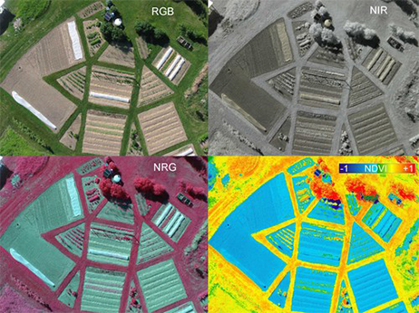
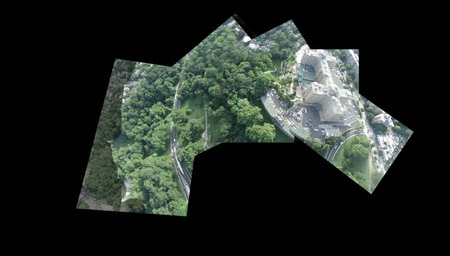
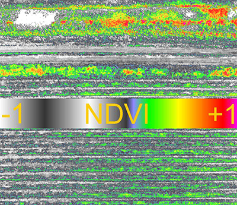
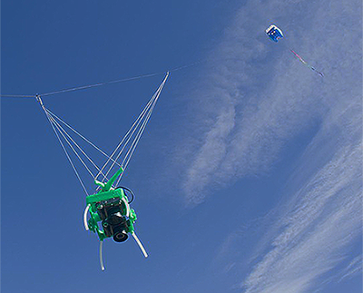
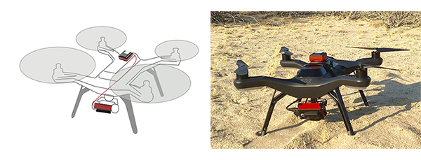
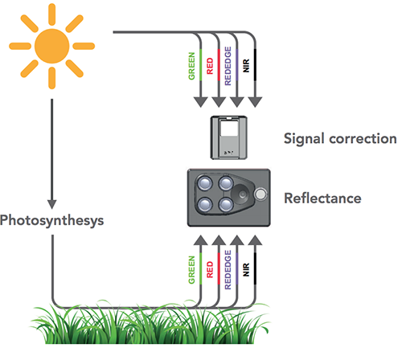

### Section 3 – Background on Methods

#### Introduction

Here we provide a narrative description of the methods used to generate and assess multi-spectral data. This is not a typical ‘Methods and Materials’ section as might be found in a more traditional scientific paper. In Section 8 and Section 9 we go into more detail regarding our specific methods. Here we set the stage for what follows and describe some of the challenges faced and overcome.

One challenge relates to our project’s having two opposing goals. On the one hand, we wanted to investigate low-cost methods in aerial photography for agriculture. This was motivated by personal interest along with a conviction that farmers have under-utilized available remote sensing technology, perhaps believing these were too complex or expensive. On the other hand, we wanted to answer questions that demand a level of precision regarding tools and methods. Exploring low-cost methods while seeking to answer empirical questions that demand accuracy (which comes at a cost) brings with it a certain tension. The questions posed by our study are presented in the [Abstract](abstract.md) but are re-stated here:

* __Can variable nitrogen rates applied to sugarcane be correlated with low-cost multi-spectral imagery?__

* __Are models of acquired multi-spectral imagery predictive of sugarcane yield?__

We were keen to answer these questions using methods which are accessible and available at modest cost. Our interest was to discover the types of vegetation index needed to correlate and predict sugarcane yield. One of these questions was correlative and we assumed it would surrender to whatever method we chose. The second question involved prediction and we thought it would be more difficult to answer unless the data captured was of high quality.

It turned out that neither question could be answered conclusively using the sort of flight and image capture systems that we originally proposed. The reasons will be addressed but in brief they are two-fold:

* Neither kites nor balloons are able to place a camera in position for sufficient time, under conditions of sufficiently stability, such that the results from one flight can be compared with results from another.
* While the sensors of a modified consumer camera are capable of capturing the right spectral data (i.e. the Red, Green and NIR light) the jpeg image format which most consumer cameras use does not support the sort of calibration necessary to quantitatively compare one day’s flight image with another.

Our _primary_ goal was to determine to what extent low-cost aerial multi-spectral data could be correlated with variable nitrogen rates applied to sugarcane. At the end of the first season we analyzed the data and came to the conclusion that the methods proposed would not work. Around the same time a third method became available that previously had seemed out of reach owing to its cost and complexity.

#### Creating the Right Spectral Index

An effective spectral index is built in stages by capturing light of the right band, at the right time of day, during the right part of the season. During our study it became apparent that the ability to place a camera in reproducible position for sufficient periods was the determining factor regarding whether our data could serve for more than qualitative assessments. Likewise, it became clear that the ability to capture in the narrowest band possible with minimum distortion was crucial.

A vegetation index can be created using only a single consumer digital camera as all consumer sensors are sensitive in the near infrared range. If the camera is modified to remove the IR blocking filter and a dual band pass filter is substituted (such that one channel captures visible light and either of the other two captures NIR) this leaves either the Green or the Blue channel available to capture NIR. However, in this scenario selecting which of the Blue or Green channel to use has an impact on the index and neither is likely to generate a result comparable to another taken on a different day. An improved solution is to use a dual-camera system where one camera captures Red while another captures the NIR. In such systems band pass filters are used to narrow the Red and NIR bands captured so that there is less contamination between them.

As an example of a dual-camera system, the composite in __Figure 1__ represents an RGB/NIR pair in the top row (left/right) captured with a pair of consumer digital cameras. The NIR photo on the top-right was taken using a modified Canon A590, from which the internal IR block filter has been removed. This sequence was created by Dr. Chris Fastie, a collaborator on this project.

###### Figure 1. A composite image containing RGB (top left), NIR (top right), NGR (CIR composite, bottom left), and NDVI renderings.

In the bottom row (__Figure 1__) two images are displayed after post-processing. On the left a false color IR image (also known as a CIR composite) contains varying degrees of Red that represent the near infrared band. In the right is a ‘normalized difference vegetation index’ NDVI image which was created using the pair above. In Section 8 and Section 9 we will take a closer look at results obtained using these and similar methods.

#### Normative Difference Vegetation Index (NDVI)

NDVI is a popular vegetation index which has been shown effective in predicting crop yield potentials in other plant species. The expression used to create an NDVI index is (NIR – Red) ÷ (NIR + Red). This expression says subtract the Red band of light from the NIR band (in the numerator) add the Red band to the NIR (in the denominator) find the quotient between the two. As an example, assume that the amount of Red reflected from a plant is 8% and the amount of NIR reflected is 50%. We’d have the following NDVI expression:

1. (0.5 – 0.08)/(0.5 + 0.08) = 0.42/0.58 = __0.72__

An NDVI of __0.72__ (on a scale of 0 to 1.0) indicates that the plant is doing well. It reflects 8% of the Red away while absorbing the remaining 92% for photosynthesis. It also reflects more than half of the harmful NIR. This is a generic pattern that we will use: higher NDVI values correlate with healthier, more productive plants. Consider the same equation applied to a different plant:

1. (0.4 – 0.3)/(0.4 + 0.3) = 0.1/0.7 = __0.14__

Compared with the first example, this plant is doing poorly. An NDVI of __0.14__ indicates that it absorbs more of the NIR light while reflecting away a good portion of the Red. Recall that plants use the Red band to power photosynthesis while NIR light presents a physiological burden. This is another generic spectral pattern that we will use: lower NDVI values correlate with unhealthy, distressed plants.

#### Creating Larger Images
NDVI is only one, albeit important, vegetation index that was used in this study. In Section 5 we discuss other index types and their specific advantages. But before creating the index itself the images must first be captured and retrieved.

Whether one uses a kite, a balloon, a drone, or a pidgeon for image capture, once the images have been taken and the craft returned safely to ground, all images must be gathered together and ‘stitched’ to create a final representation. Figure 3 shows the result of stitching a dozen or so images from a balloon flight. This task is commonly performed by software but here an application provided by the citizen science group Public Lab is used to visually stitch each image over a map of the areal extent. This approach reveals how an image is often stretched and distorted in order to make it fit orthogonally onto a planar map. Achieving a seamless result requires exact overlap with identical exposure times between images.

The resolution of the image data gathered and stitched together ultimately rests on a number of factors, each representing a point in the overall process where error may be introduced. The ultimate goal of stitching images is to form a reflectance map – a mosaic of the area of interest where each pixel in the image represents the reflectance of the imaged area.

###### Figure 2. An animation of the stitching process. A dozen images are manually brought together into one larger image.

In turn, the resolution of the final image depends on the stability of the capture event, the resolution of the camera, and the stitching process. Of interest is the resolution per pixel. With regard to aerial photography, resolution (also called ground sample distance) refers to the area of ground covered by an individual pixel. With regard to a digital camera, resolution can also refer to the number of pixels contained in the sensor. When using the term ‘resolution’ we usually mean the ground sample distance. This important concept is covered in greater detail in [Section 8](study_results_balloons.md) when discussing the results of kites and balloons.

#### Interpreting Spectral Indices

We have seen that interpreting a vegetation index starts with acquiring accurate aerial image data and that doing so requires consideration of two fundamental issues:

1. Placing the camera at the correct height and orientation for a sufficient period of time.

    * In [Section 4](kites_balloons_drones.md) three possible methods for positioning a camera in the air (a kite, a helium-filled balloon, and an aerial drone) will be considered. Each has its advantages and disadvantages.
2. Acquiring sufficient spectral detail from a camera such that the data may be usefully analyzed.

    * The phrase ‘sufficient spectral detail’ will be unpacked but essentially means clear separation of the individual bands of captured light.

__Figure 3__ illustrates a typical NDVI result using a kite-suspension system with two consumer-grade cameras modified for NDVI. The image in the center of the figure represents a color LUT (i.e. a look-up table) which is used to apply a color transform to an image. Applying this transform allows us to visualize reflected light that otherwise would be impossible to see.

###### Figure 3. An NDVI index image taken with a consumer grade dual-camera system. The center bar is a color LUT.

In the image the LUT is prominently displayed in order to indicate that a full range of values has been captured in this image – from dry, sandy soils on the upper left (with an NDVI value of -1) to active areas of photosynthesis on the upper right. Also visible are regions of immature crop that are less well developed on the lower left compared with lower right.

###### Figure 4. A dual camera system used to take the image contained in Figure 3.

Though it offers a qualitative view only, an index image produced from a kite remains a useful tool to help identify and track potential trouble spots in a developing crop. Having a simple kite rig in the back of the truck can assist in crop scouting. With a clear sky and brisk wind, a kite flight takes thirty minutes and is time well spent if it points out regions of the field that are underdeveloped or damaged.

While the result produced in __Figure 3__ is useful and may be achieved for a couple hundred dollars and a weekend of practice, these are qualitative, not _quantitative_ results. If the goal is to measure patterns over time then this method will not work. While not impossible, it is difficult to replicate the exact height and vantage point of a image taken during a flight with a kite or a balloon. On another day under different skies such images will be hard to replicate. Since a stated goal was to use low-cost methods to accurately determine crop trends over time we decided to look for a more accurate solution.

###### Figure 5. The 3DR Solo drone with a Parrot Sequoia camera and its ‘sun sensor’ (on top).

#### Semi-Autonomous Methods
Unmanned Aerial Vehicle (UAV) is an all-encompassing term which includes the aircraft, ground-based controller, and system of communication between the two. Commonly known as drones, semi-autonomous aircraft have been around for years but only recently have become available on the consumer market. The challenge of earlier drones in agriculture relates to their usability and cost. Prior to 2014 a fixed wing drone capable of flying (with payload) more than a few hundred yards cost anywhere from $10–30K. Small, high-resolution sensors were also available but these could add another $15-35K. Until recently it could cost anywhere from $25K to $65K to place a UAV in the air and retrieve meaningful data. Since 2014 that price has fallen to below $5000.00.

###### Figure 5. A multi-spectral narrow band camera, the Sequoia, produced by Parrot. On the right is the Sunshine sensor.

As UAV drone prices have fallen so too have options become available regarding use of a truly professional grade instrument (in place of a consumer camera). A Washington state-based company named Micasense produced the first small form-factor multi-spectral camera, the Sequoia, in 2016. Though the price of this instrument is high relative to a modified consumer camera, it is not out of reach. With Micasense’s help we were able to use the Sequoia during the 2017 season.

The Sequoia is the same size as a GoPro camera. It’s small and lightweight enough to serve as payload for a consumer-style drone such as the 3DR Solo. The camera includes a ‘sun sensor’ which sits on top of the drone (the camera is below pointing down).

###### Figure 6. A sugarcane field reflects light in specific ways that are picked up by the Sequoia camera, calibration occurs in tandem with the sunshine sensor. 

__Figure 7__ indicates the value of the Sequoia compared with other cameras that we tried. The most troublesome aspect of a consumer camera (as discussed in Section 4) is the difficulty of calibrating each image such that the final stitched product contains uniform pixel intensities that accurately reflect the intensity of light during a particular flight. Calibration is crucial both within flight (since many images are stitched together) and between flights (since illuminant conditions change from day to day). If the intensity of light varies from moment to moment or from day to day, the amount of reflected energy from the field will be altered and the result will be innaccurate.

To manage the variability of light the Sequoia uses a ‘sunshine sensor’ to continuously record ambient light conditions in the same spectral bands as the camera sensor does. This ingenious system allows the camera to be used in clear or overcast conditions on the same day. Each image can be adjusted accordingly on-the-fly. This improvement was key to allowing us to record image data in a consistent and repeatable manner.

#### Summary

After an initial year of ups and downs using systems originally proposed it became apparent that for a modest investment one could use an aerial drone instead. Our team was among the first to fly a 3DR Solo drone with the Sequoia camera.

Various flying methods, while interesting in themselves, are only a means to the end of placing a camera into position in order to capture the right light at the right time of day. Before venturing into the core methods used in our study and the results obtained we first set the stage by discussing some earlier methods that were used and why they did not succeed.

For agricultural purposes, the broadband sensors contained in a modified camera are suited to a qualitative ‘big picture’ views of a crop’s current status. However, the information provided by such cameras is limited and does not permit detailed analysis of a crop over time.

In the next we discuss the various bands of reflected and captured light and how these are used to facilitate our understanding of crop health. In [Section 5](spectral_indices.md) we consider in greater detail how such principles allow us to manipulate the captured bands and reveal more interesting and specific patterns. Here we have focused on general principles which makes all of this possible. More detailed results from balloon and kite methods are presented in [Section 8](study_results_balloons.md) and in [Section 9](study_results_drones.md).

#### Next section >> [Kites, Balloons, and Drones](kites_balloons_drones.md)

### [Table of Contents](abstract.md)