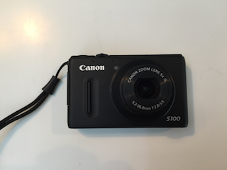
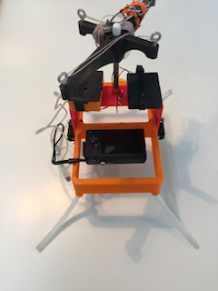
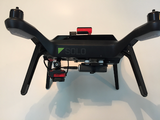

### Study Goals and Methods

#### Introduction

This section provides a description of the various tools and methods used to generate and assess multi-spectral data in 
sugar cane. We also describe some of the challenges faced in gathering such data. Throughout this study our objective 
has been to test the viability of low-cost methods for acquiring and processing aerial multi-spectral data. 

Our primary goal was to determine to what extent low-cost aerial multi-spectral data can be correlated with variable 
nitrogen (N) rates applied to sugarcane. NDVI is a popular vegetation index which has been shown to be effective in 
predicting crop yield potentials (YP) in wheat, sorghum and other plant species. __[fn]__ Yet acquisition and interpretation 
of these data using traditional methods is expensive, error prone, and often beyond reach of most Louisiana sugar cane growers.

The systems we proposed at the outset of our study were both affordable and accessible. How accurately they might correlate 
NDVI other vegetation indices to known nitrogen (N) rates was unknown. Over the course of our study a third option became 
tenable (UAV's) and was explored in depth in the second year of the grant.

We asked two questions:

* __To what degree do variable nitrogen (N) rates applied to sugarcane correlate with low-cost NDVI measurements?__

* __Are in-season models predictive of sugarcane yield potential based on time-series analysis of the acquired imagery?__

Early in the project we experimented with various capture systems (automatically-triggered cameras) and suspension methods 
using kites and balloons. The central challenge of an aerial system based on wind alone is variability in the 
control of height and nadir positioning of the camera. Wind also impacts the performance of balloons during flight. 
Additional factors to consider are payload weight and total flight time. 

#### More on Plant Biology

* Creating an effective spectral index means capturing the right sort of light, at the right time of day. 
* Interpreting spectral indices requires capturing data at the right time in the growing season.

 
###### Figure 2.

Earlier we learned about a set of images that were captured using a pair of consumer cameras. These were later processed to produce both an NRG
image along with a final index image, known as an NDVI index. The mathematical expression used to create an NDVI index 
is as follows:

__(NIR - Red) / (NIR + Red) =  NDVI__

This expression says "subtract the red from the NIR band in the numerator, add the same red band to the NIR in the denominator, 
find the quotient between the two." With this knowledge let's create a couple of sample NDVI calculations:

Assume that the amount of visible red light reflected from the tree on the left in __Figure 1__ is 8% and that the amount of NIR 
reflected is 50%. In this case we'd have the following NDVI expression: 

(0.5 - 0.08)/(0.5 + 0.08) = 0.42/0.58 = __0.72__ 

An NDVI value of 0.72 (on a scale of 0 to 1.0) indicates that the tree on the left is doing well. It's reflecting 8% of the red light away while absorbing 
the remaining 92% for photosynthesis. It's also reflecting more than half of the harmful NIR light away. 
This is a generic spectral pattern that we can use: _higher NDVI values correlate with healthier, more productive plants_. 

Consider the same equation applied to the tree on the right of __Figure 1__. 
  
(0.4 - 0.3)/(0.4 + 0.3) = 0.1/0.7 = __0.14__ 

Compared with the tree on the left, this one is doing poorly. It's absorbing more than half of the NIR 
light while reflecting away a good portion of the red. Recall that plants use red light to power photosynthesis while NIR 
light presents a physiological burden to them. This is another generic spectral pattern that we can use: _lower NDVI values correlate with unhealthy, distressed plants_. 

[Section 3](kites_balloons_drones.md) discussed the various bands of reflected and captured light and how these 
may be used to facilitate an understanding of crop health. In [Section 5]() we will consider in greater detail how 
such principles allow us to manipulate the captured bands and reveal more interesting and specific patterns. 
In this section we will focus on general principles which makes all of this possible. 

###### Figure 1.

#### Base Requirements

__Figure 1__ illustrates a typical NDVI result using a kite-suspension system with two consumer-grade cameras modified 
for NDVI. The image in the center of the figure represents a color LUT (i.e. a look-up table) which is a table of 
numbers used to apply a color transform to an image. Applying this transform allows us to visualize reflected light that 
otherwise would be impossible to see. In this image the LUT is prominently displayed in order to indicate that a full 
range of values has been captured by this image - from dry, sandy soils on the upper left (with an NDVI value of -1) to very active 
areas of photosynthetic activity on the upper right. Also visible are regions of immature crop which are less 
developed on the lower left when compared with the right. 

An index image like this is a useful tool for identifying potential trouble spots in a developing crop. Later 
on in the season a flight like this might quickly point out regions of the field that are underdeveloped or damaged. 
While these results are certainly useful and can be achieved for a few hundred dollars and perhaps a 
weekend of practice, they are largely __qualitative__ and __not quantitative__. If the goal was to determine more precisely 
a general pattern over time then this method would present challenges. While not impossible, it is difficult to replicate 
the exact height and vantage point of a image taken during a flight with a kite or a balloon. On another day under different 
conditions these images would be hard to precisely duplicate. Since one of our stated goals was to accurately determine crop 
trends over time using low cost methods we decided to look at other methods. 
 
More detailed results from balloon and kite methods are presented in [Section 8](study_results_balloons.md). 

In general, acquiring accurate aerial image data requires consideration of two fundamental issues: 

1. Placing a camera at the correct height and orientation for a sufficient period of time.

    * In [Section 3](kites_balloons_drones.md) three possible methods for positioning a camera 
    in the air (a kite, a helium-filled balloon, and an aerial drone) are considered. Each has its advantages and 
    disadvantages.
    
2. Acquiring sufficient spectral detail from a camera such that the data may be usefully analyzed.

    * The phrase 'sufficient spectral detail' will be unpacked but essentially means clear separation of the 
    individual bands of captured light.  
    
It became apparent during our study that the ability to place a camera in a relatively steady position for sufficient 
periods of time was a determining factor in whether or not our data would be meaningful for more than a qualitative assessment
at a single point in time. Likewise it became clear that the ability to capture in the narrow band, with minimum distortion, 
was critical. 

#### Consumer-grade versus Professional Systems

* The Spectral Sensitivity of Cameras

###### Figure 1. A modified Canon S100 consumer camera.

For agricultural purposes, the broadband sensors contained in a modified camera such as the Canon s100 in __Figure 1__ are 
suited to qualitative 'big picture' views of a crop's current status. However, the information provided by such cameras
is limited and does not permit detailed analysis of a crop over time.

###### Figure 1. Dual-camera system with harness and Picavet. 

As discussed in [Section 3](kites_balloons_drones.md) a kite or a helium-filled balloon may serve a useful purpose in 
providing a quick overview of a crop but the results produced are often variable and may be difficult to reproduce. 

###### Figure 2. Sequoia camera (bottom left) with power supply (right) and Sun sensor (top) attached to the 3DR Solo. 

After an initial year of ups and downs using the systems originally proposed for this work it became apparent that 
for a small investment one could use an aerial drone instead. We were among the first 'beta-testers' to fly
a 3DR Solo drone with a Sequoia camera.  

Center wavelength and bandwidth specs for the Sequoia camera are: 

| Band Name | Center Wavelength (nm) | Bandwidth (nm) |
|-----------|:----------------------:|:--------------:|
| Green     |           550          |       40       |
| Red       |           660          |       40       |
| Red Edge  |           735          |       10       |
| Near IR   |           790          |       40       |

#### Qualitative versus Quantitative Science.

* Lorem ipsum dolor sit amet
* Lorem ipsum dolor sit amet
* Lorem ipsum dolor sit amet

#### Summary

Lorem ipsum dolor sit amet, consectetur adipiscing elit, sed do eiusmod tempor incididunt ut labore et dolore magna aliqua. Ut enim ad minim veniam, quis nostrud exercitation ullamco laboris nisi ut aliquip ex ea commodo consequat. Duis aute irure dolor in reprehenderit in voluptate velit esse cillum dolore eu fugiat nulla pariatur.

###### References
__Figure 1__ Image source: https://earthobservatory.nasa.gov/Features/MeasuringVegetation/measuring_vegetation_2.php

 