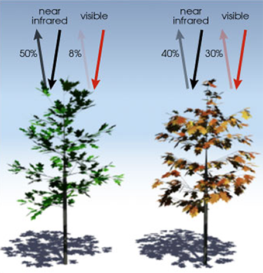

### Study Goals and Methods

#### Introduction

This section provides a description of the various of tools and methods used to generate and assess multi-spectral data in 
sugar cane. We also describe some of the challenges faced in gathering such data. Throughout this study our objective 
has been to test the viability of low-cost methods for acquiring and processing aerial multi-spectral data. 

Our primary goal was to determine to what extent low-cost aerial multi-spectral data could be correlated with variable 
nitrogen (N) rates when applied to sugarcane. NDVI is a popular vegetation index which has been shown to be effective in 
predicting crop yield potentials (YP) in wheat, sorghum and in other plant species. __[fn]__  Yet acquisition and interpretation 
of these data for sugarcane using traditional methods is expensive, error prone, and often beyond reach of most 
Louisiana growers.

The systems we proposed at the outset were both affordable and accessible. How accurately they might correlate 
NDVI other vegetation indices to known nitrogen (N) rates was unknown.

We asked two questions:

* __To what degree do variable nitrogen (N) rates applied to sugarcane correlate with low-cost NDVI measurements?__

* __Are in-season models predictive of sugarcane yield potential, based on time-series analysis of the acquired imagery?__

Early in the project we experimented with various capture systems and suspension methods using kites and 
balloons. The central challenge of an aerial system based on wind power alone is variability in the 
control of the height and nadir positioning of the cameras. Wind also impacts the performance of balloons during flight. 
Additional factors to consider are payload weight and total flight time. 

__Figure 1__ illustrates a typical NDVI result using a kite-suspension system with two consumer-grade cameras modified 
for NDVI. The image in the center of the figure represents a color LUT (i.e. a look-up table) which is simply a table of 
numbers used to apply a color transform to the image. Applying this transform allows us to visualize the light that 
otherwise we would be incapable of seeing. In this image the LUT has been prominently displayed to indicate that a full 
range of values is captured in the image - from dry, sandy soil on the upper left (with an NDVI value of -1) to very active 
areas of photosynthetic activity on the upper right. Also shown are developing areas of the young crop. 

An index image like this can be a useful tool to identify potential trouble spots in a developing crop. Later 
in the season a flight can quickly point out regions of the field that may be suffering or have been damaged. 
While these results are certainly useful and may be achieved for no more than a few hundred dollars and perhaps a 
weekend of practice, they are largely qualitative and not quantitative. If the goal is to determine general patterns 
over time they are hard to replicate. One of our goals is to accurately determine trends over time using low cost methods. 
 
The final results of our study are 
presented in [Section 8](study_results_balloons.md) and [Section 9](readme_resources/study_results_drones.md). 

In general, acquiring accurate aerial image data requires consideration of two fundamental questions: 

1. How to place a camera at the correct height and orientation for a sufficient period of time.

    * In [Section 3](kites_balloons_drones.md) we considered three possible methods for positioning a camera 
    in the air: a kite, a helium-filled balloon, and an aerial drone. Each has its advantages and disadvantages.
    
2. How to acquire sufficient spectral detail from a camera such that the data may be usefully analyzed.

    * The phrase 'sufficient spectral detail' will be unpacked but essentially this means clear separation of the 
    individual bands of light.  
    
It became apparent during our study that an ability to capture a narrow bands of light with minimum distortion was critical. 
In addition, the ability to place a camera in a relatively steady position for sufficient periods of time was a determining 
factor in whether or not our data was meaningful.

#### Consumer-grade versus Professional Cameras

  

###### More on Plant Biology

* Creating an effective spectral index means capturing the right sort of light, at the right time of day. 
* Interpreting spectral indices requires capturing data at the right time in the growing season.
* Thoughts on qualitative versus quantitative science.

In [Section 3](kites_balloons_drones.md) we learned about the various bands of reflected and captured light and how these 
may be used to facilitate an understanding about crop health. In a [Section 5]() we will consider in greater detail how 
these principles allow us to manipulate the captured bands in order to reveal more interesting and specific patterns. 
Here we will focus on general principles which makes all of this possible. 

 

__Figure 1.__

Earlier we learned about a set of images that were captured using a pair of consumer cameras. These were later processed to produce both an NRG
image along with a final index image, known as an NDVI index. The mathematical expression used to create an NDVI index 
is as follows:

__(NIR - Red) / (NIR + Red) =  NDVI__

This expression says "subtract the red from the NIR band in the numerator, add the same red band to the NIR in the denominator, 
find the quotient between the two." With this knowledge let's create a couple of sample NDVI calculations:

Assume that the amount of visible red light reflected from the tree on the left in __Figure 1__ is 8% and that the amount of NIR 
reflected is 50%. In this case we'd have the following NDVI expression: 

(0.5 - 0.08)/(0.5 + 0.08) = 0.42/0.58 = __0.72__ 

An NDVI value of 0.72 (on a scale of 0 to 1.0) indicates that the tree on the left is doing well. It's reflecting 8% of the red light away while absorbing 
the remaining 92% for photosynthesis. It's also reflecting more than half of the harmful NIR light away. 
This is a generic spectral pattern that we can use: _higher NDVI values correlate with healthier, more productive plants_. 

Consider the same equation applied to the tree on the right of __Figure 1__. 
  
(0.4 - 0.3)/(0.4 + 0.3) = 0.1/0.7 = __0.14__ 

Compared with the tree on the left, this one is doing poorly. It's absorbing more than half of the NIR 
light while reflecting away a good portion of the red. Recall that plants use red light to power photosynthesis while NIR 
light presents a physiological burden to them. This is another generic spectral pattern that we can use: _lower NDVI values correlate with unhealthy, distressed plants_. 

###### Section II

* The Spectral Sensitivity of Cameras
* Lorem ipsum dolor sit amet
* Lorem ipsum dolor sit amet

###### Section III

* Lorem ipsum dolor sit amet
* Lorem ipsum dolor sit amet
* Lorem ipsum dolor sit amet

###### References
__Figure 1__ Image source: https://earthobservatory.nasa.gov/Features/MeasuringVegetation/measuring_vegetation_2.php

 