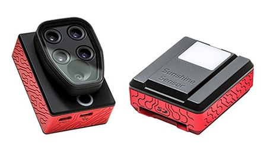

### 3 - Background on Methods and Materials

#### Introduction

This section provides a narrative description of methods used to generate and assess multi-spectral data. It is not 
a standard 'Methods and Materials' section as might be found in a traditional scientific paper. In [Section 8]() and 
[Section 9]() we go into greater detail regarding methods, including preparation of the study 
site, final results, etc. Here we set the stage for what follows and describe some of the challenges faced.

One challenge for this project relates to its being essentially a 'two-headed' endeavor. On the one hand, we want to 
investigate low-cost methods in aerial photography for agriculture. This desire is motivated by an interest in the subject along with a 
general conviction that farmers themselves have under-utilized aerial techniques that are readily available to them. 
On the other hand, we also want to ask technical scientific questions which requires a level of sophistication regarding
methods of data capture and analysis. These threads are not necessarily at cross purposes, in fact they are related, though
in pursuing them we have sometimes felt a degree of tension.    

Throughout this study we have been guided by two empirical questions that are not directly related to the selection of a 
flight method or to the type of camera used to gather image data. 

* __To what degree do variable nitrogen (N) rates applied to sugarcane correlate with low-cost NDVI measurements?__

* __Are models based on time-series analysis of acquired imagery predictive of sugarcane's yield potential?__

#### Disclaimer

From the outset we considered that the second question was not likely to be answered unless the data captured was 
of sufficient quality. The first was answerable, we thought, regardless of data capture method. It turns out we were wrong. Neither of these questions could be answered conclusively using the sort of 
flight and image capture system originally proposed. The specific reasons will be addressed in detail 
but in brief they are two-fold: a) neither kite nor balloon is able to place a camera in position for sufficient 
time, under conditions which are sufficiently stable, such that results from one flight can be compared with results from 
another; and b) while the sensor of a modified consumer camera is capable of capturing the right spectral data (i.e. the red, 
green and NIR light) the jpeg image format of most consumer cameras does not readily support the sort of 
calibration necessary to quantitatively compare one day's flight with another.        

An effective spectral index is built in stages by capturing the right kind of light, at the right time of day,
during the right part of the season, under good weather conditions. During our study it became apparent that the ability 
to place the camera in steady position for sufficient periods was a determining factor in whether or not our 
data would be meaningful for more than 'point-in-time' qualitative assessment. Likewise it became clear 
that the ability to capture in the narrowest band possible, with minimum distortion, was likewise critical.

Our primary goal was to determine to what extent low-cost aerial multi-spectral data could be correlated with variable 
nitrogen (N) rates applied to sugarcane. At the end of the first season we analyzed the data and came to the conclusion
that the methods proposed would not work.  

NDVI is a popular vegetation index which has been shown to be effective in 
predicting crop yield potentials in other plant species. 

The mathematical expression used to create an NDVI index is as follows:

__(NIR - Red) / (NIR + Red) =  NDVI__

This expression says "subtract the red from the NIR band (in the numerator), add the same red band to the NIR 
(in the denominator), find the quotient between the two." Assume that the amount of visible red light reflected from 
the tree on the left in __Figure 1__ is 8% and that the amount of NIR reflected is 50%. In this case we'd have the 
following NDVI expression: 

1. (0.5 - 0.08)/(0.5 + 0.08) = 0.42/0.58 = __0.72__ 

An NDVI value of 0.72 (on a scale of 0 to 1.0) indicates that the tree on the left is doing well. It's reflecting 8% of 
the red light away while absorbing the remaining 92% for photosynthesis. It's also reflecting more than half of the 
harmful NIR light away. This is a generic spectral pattern that we can use: _higher NDVI values correlate with healthier, 
more productive plants_. Consider the same equation applied to the tree on the right: 
  
2. (0.4 - 0.3)/(0.4 + 0.3) = 0.1/0.7 = __0.14__ 

Compared with the healthy tree, this one is doing poorly. It's absorbing more than half of the NIR 
light while reflecting away a good portion of the red. Recall that plants use red light to power photosynthesis while NIR 
light presents a physiological burden to them. This is another generic spectral pattern that we can use: _lower NDVI values correlate with unhealthy, distressed plants_. 

#### Single or Dual-Camera Systems

It is possible to create a vegetation index image using only a single consumer digital camera as almost all consumer camera sensors are
sensitive in the near infrared range. If the camera is modified to remove the IR blocking filter and a dual band pass filter is 
substituted (such that one channel captures visible light and either of the other two channels captures NIR light) this leaves either 
the green or the blue channel available for capturing NIR. However, in this scenario choosing which of the blue or the green channel 
to use has a direct impact on the final result. Furthermore, neither channel is likely to generate a result that 
is comparable to another image taken on a different day under different lighting conditions.  

An improved solution is to use a dual-camera system where one camera captures red light while another captures the NIR. 
In such systems special band pass filters are used to narrow the red and NIR bands captured so that there is less contamination 
between the two. 
 
As an example of a dual-camera system, the composite image in __Figure 6__ represents an RGB/NIR pair in the top row (left/right) 
captured with a pair of consumer digital cameras. The NIR photo on the top-right was taken using a modified Canon A590, 
from which the internal IR block filter has been removed.  

###### Figure 4.

In the bottom row are two images after post-processing the top two. On the left is a false color IR image (also known as 
an NRG image) with varying tones of red representing the near infrared band. In the bottom-right is a 'normalized 
difference vegetation index' __NDVI__ image which has been created using the pair above. In [Section 8](study_results_balloons.md) and 
[Section 9](study_results_drones.md) we will take a closer look at results obtained when
using these and similar methods. 

After an initial year of ups and downs using the systems originally proposed it became apparent that 
for a small investment one could use an aerial drone instead. We were among the first 'beta-testers' to fly
a 3DR Solo drone with a Sequoia camera.  

Whether one uses a kite, a balloon, a drone, or a pidgeon, once the images have been taken and the craft returned safely to ground,
all images must be gathered and 'stitched' to create a final representation of the area. 

__Figure 3__ shows the result of stitching a dozen or so images from a balloon flight. This task is commonly 
performed by software but here an application provided by the citizen science group 
[Public Lab](https://publiclab.org/) is used to visually stitch each image over a map of the areal extent. 
This approach reveals how an image is often stretched and distorted in order to make it fit orthogonally onto a planar map. Achieving a 
seamless result requires exact overlap with identical exposure times between images. 

The ultimate goal of stitching images is to form a reflectance map - a mosaic of the area of interest where 
each pixel in the image represents the reflectance of the imaged area. This process is generally known as photogrammetry.

The resolution of the image data gathered and stitched together ultimately rests on a range of factors, each 
representing a point in the overall process where error may be introduced.    

###### Figure 3.

In turn, the resolution of the final image __analyzed__ depends on the stability of the capture event, on the resolution 
of the camera at that given moment, and on the stitching process that brings the separate images together. Of interest is the __resolution per pixel__ since each pixel ultimately represents an 
area of the total crop section. With regard to aerial photography, resolution (also called ground sample distance) 
refers to the area of ground covered by an individual pixel. With regard to a digital camera, resolution may also refer to the 
number of pixels in the sensor.  Hereinafter, when using the term 'resolution' we usually mean the ground sample distance. 
We cover this in greater detail in [Section 8](study_results_balloons.md) when discussing the results of kites and balloons.

#### Interpreting Spectral Indices 

Interpreting a spectral index starts with acquiring accurate aerial image data. Doing so requires consideration of two fundamental issues: 

1. Placing the camera at the correct height and orientation for a sufficient period of time.

    * In [Section 3](kites_balloons_drones.md) three possible methods for positioning a camera 
    in the air (a kite, a helium-filled balloon, and an aerial drone) were considered. Each has its advantages and 
    disadvantages.
    
2. Acquiring sufficient spectral detail from a camera such that the data may be usefully analyzed.

    * The phrase 'sufficient spectral detail' will be unpacked but essentially means clear separation of the 
    individual bands of captured light.
 

__Figure 2__ illustrates a typical NDVI result using a kite-suspension system with two consumer-grade cameras modified 
for NDVI. The image in the center of the figure represents a color LUT (i.e. a look-up table) which is a table of 
numbers used to apply a color transform to an image. Applying this transform allows us to visualize reflected light that 
otherwise would be impossible to see. In this image the LUT is prominently displayed in order to indicate that a full 
range of values has been captured by this image - from dry, sandy soils on the upper left (with an NDVI value of -1) to very active 
areas of photosynthetic activity on the upper right. Also visible are regions of immature crop which are less 
developed on the lower left when compared with the right. 
 
An index image like this is a useful tool for identifying potential trouble spots in a developing crop. Later 
on in the season a flight like this might quickly point out regions of the field that are underdeveloped or damaged. 
While these results are certainly useful and can be achieved for a few hundred dollars and perhaps a 
weekend of practice, they are largely __qualitative__ and __not quantitative__. If the goal was to determine more precisely 
a general pattern over time then this method would present challenges. While not impossible, it is difficult to replicate 
the exact height and vantage point of a image taken during a flight with a kite or a balloon. On another day under different 
conditions these images would be hard to precisely duplicate. Since one of our stated goals was to accurately determine crop 
trends over time using low cost methods we decided to look at other methods.  
 

###### Figure x

Lorem ipsum dolor sit amet, consectetur adipiscing elit, sed do eiusmod tempor incididunt ut labore et dolore magna aliqua. Ut enim ad minim veniam, quis nostrud exercitation ullamco laboris nisi ut aliquip ex ea commodo consequat.

###### Figure x

Lorem ipsum dolor sit amet, consectetur adipiscing elit, sed do eiusmod tempor incididunt ut labore et dolore magna aliqua. Ut enim ad minim veniam, quis nostrud exercitation ullamco laboris nisi ut aliquip ex ea commodo consequat.

###### Figure x

Lorem ipsum dolor sit amet, consectetur adipiscing elit, sed do eiusmod tempor incididunt ut labore et dolore magna aliqua. Ut enim ad minim veniam, quis nostrud exercitation ullamco laboris nisi ut aliquip ex ea commodo consequat.

###### Figure x

Lorem ipsum dolor sit amet, consectetur adipiscing elit, sed do eiusmod tempor incididunt ut labore et dolore magna aliqua. Ut enim ad minim veniam, quis nostrud exercitation ullamco laboris nisi ut aliquip ex ea commodo consequat.

#### Qualitative versus Quantitative Science.

Qualitative Research is primarily exploratory research. It is used to gain an understanding of underlying reasons, opinions, and motivations. It provides insights into the problem or helps to develop ideas or hypotheses for potential quantitative research. Qualitative Research is also used to uncover trends in thought and opinions, and dive deeper into the problem. Qualitative data collection methods vary using unstructured or semi-structured techniques. Some common methods include focus groups (group discussions), individual interviews, and participation/observations. The sample size is typically small, and respondents are selected to fulfil a given quota.

Quantitative Research is used to quantify the problem by way of generating numerical data or data that can be transformed into usable statistics. It is used to quantify attitudes, opinions, behaviors, and other defined variables – and generalize results from a larger sample population. Quantitative Research uses measurable data to formulate facts and uncover patterns in research. Quantitative data collection methods are much more structured than Qualitative data collection methods. Quantitative data collection methods include various forms of surveys – online surveys, paper surveys, mobile surveys and kiosk surveys, face-to-face interviews, telephone interviews, longitudinal studies, website interceptors, online polls, and systematic observations.

#### Summary

[Section 3](kites_balloons_drones.md) discusses the various bands of reflected and captured light and how these 
may be used to facilitate an understanding of crop health. In [Section 5]() we consider in greater detail how 
such principles allow us to manipulate the captured bands and reveal more interesting and specific patterns. 
Here we focus on general principles which makes all of this possible. More detailed results from balloon 
and kite methods are presented in [Section 8](study_results_balloons.md) and in [Section 9](study_results_drones.md). 

Various flying methods, while interesting in themselves, are only a means to the end of placing a camera into 
position in order to capture the right light at the right time of day. Before venturing into the core methods used 
in our study and the results obtained we first set the stage by discussing some earlier methods that were used and why 
they did not succeed. 

For agricultural purposes, the broadband sensors contained in a modified camera such as the Canon s100 in __Figure 1__ are 
suited to qualitative 'big picture' views of a crop's current status. However, the information provided by such cameras
is limited and does not permit detailed analysis of a crop over time.

As discussed in [Section 3](kites_balloons_drones.md) a kite or a helium-filled balloon may serve a useful purpose in 
providing a quick overview of a crop but the results produced are often variable and may be difficult to reproduce. 

###### References
[TBD]

 