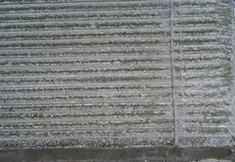
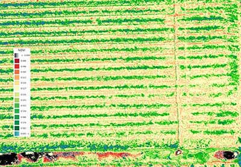
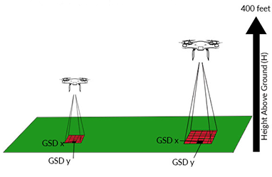
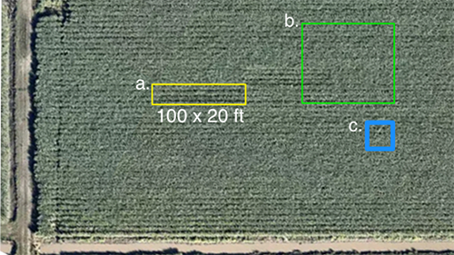

### 8 - Results Using Balloons and Kites

#### Introduction

When our project began the plan was to use methods that are readily available to anyone and to apply these in 
ways that do not impose a high barrier in terms of time and materials. Farmers are generally practical with regard to the 
kinds of tools they are willing to try. Most are eager to learn a new method if it helps solve 
a long-standing problem more efficiently. 

As an example, crop scouting has existed as long as farming has and its methods 
have changed little except what was once done on foot or by horse is now done in a pick-up truck. If a kite and a camera 
can do the same work while adding more information then chances are these tools will be adopted. With that sentiment in 
mind we discuss results obtained by experimenting with kites and balloons

###### Figure 1. RGB image captured with a Delta kite at height of 125ft. Ground control points (in yellow) are visible.

#### Image capture and preparation

__Figure 1__ is a RGB composite image captured with a kite and stitched together 'by hand' with the help of ground control points (GCPs) 
spray-painted into the field. Having GCPs in a set of images like this is crucial both for stitching together the final 
image and for comparing image sets over time. To support this process we used an open source software known as 
[Fiji](https://fiji.sc/). Fiji is an image processing package that bundles an incredible variety of plugins to facilitate 
scientific image analysis.  

To determine the height of a flight we carefully measured and marked the kite's flight line. This set of 
captures was taken at a height of about 125ft. Maintaining a steady altitude like this with a kite can be a challenge when the 
wind is variable. This was a key challenge faced with kites. 

#### JPEG versus RAW Format

In addition to challenges imposed by weather there are those associated with the choice of camera, especially the choice of 
image format. A common default for consumer cameras is JPEG (Joint Photographic Experts Group). The JPEG format in many cameras 
has processing built in at the time of capture, to adjust contrast, reduce noise or brighten and sharpen the image before 
rendering it to a file. These processing steps are intended to render images that are visually appealing 
to the human eye. As a result pixel values of a JPG-processed image lack a 'true' relationship with the intensity of light 
that originally impinges on the sensor. Details regarding how a JPEG file is processed by a particular camera are not easy 
to come by and disabling such 'features' is usually not a practical option.

Other sources of artifact in JPEG images are compression and band distortion. Digital Image 
Compression (DIC) attempts to address the issue of storage and transmission since space is usually at a premium in a consumer-grade 
camera. For our purposes, image pre-processing, compression and band distortion are less features than issues to be corrected. 
They impact an ability to utilize _all_ the bandwidth data in post-processing.

As an alternative, some consumer cameras support the RAW format, which preserves all of the bandwidth data. However, RAW images are larger 
than JPEGs and the rate of capture required during flight (to achieve an acceptable ground resolution) makes their
use prohibitive. For this reason our results using consumer cameras are based on the JPEG format. How to accurately calibrate for reflectance 
under changing illuminant conditions while limited to JPEG is an issue that has been addressed by others (for excellent
work in this area see Public Lab postings [here](https://publiclab.org/notes/nedhorning/07-10-2014/using-a-raw-image-to-calibrate-a-jpeg-image)
and [here](https://publiclab.org/notes/nedhorning/06-30-2015/automating-ndvi-calibration)). 

Finally, the lack of accurate geo-tagging support in most consumer cameras means there's no reliable source of reference regarding planar or 
vertical positioning of the camera with respect to the ground. A hand-held GPS device was used to create the ground
control points in these images but it was not always possible 'geo-tag' and match each capture with a known position 
on the ground. Having obtained a set of images we then scripted a process in Fiji to help align, stitch and create the vegetation index.  
   
#### Post-processing JPEG images
Details regarding how to create a vegetation index such as NDVI using the Fiji software package are described in detail by Chris Fastie
and Ned Horning on Public Lab's website [here](https://publiclab.org/wiki/photo-monitoring-plugin) and 
[here](https://publiclab.org/notes/nedhorning/5-31-2012/registering-and-processing-photos-acquired-two-cameras). 
The [Public Lab](https://publiclab.org/) community has been a leader in this field and the information they have compiled 
over the years has served both as inspiration and as a guide throughout our work. 

###### Figure 2. RGB and NDVI image processed using Fuji. The RGB image was captured with a Delta kite at a height of 125ft.
__Figure 2__ is an NDVI index derived from RGB and NIR sets using a pair of modified consumer cameras. It was taken 
from a height of about about 125 ft early in the growth season. The vertical LUT displays NDVI values between 0.45 and 0.60. 
This particular image shows an interesting effect that we saw throughout while using our dual-camera NDVI system. The NDVI 
values of soil show values in the lower range (0.45) compared to the green areas of early 
growth. At low altitudes our dual-camera system tended to record non-vegetation sources somewhat lower than at higher altitudes 
while remaining fairly consistent overall in terms of vegetation.  

###### Figure 3. RGB and NDVI image from 200 ft.
__Figure 3__ is another NDVI index derived from RGB and NIR image sets, this time taken from a height of about 
200 ft. The only difference between this figure and the one above it is an increase in altitude of 75 feet. 
Each image was taken on the same day with the same lighting conditions and in the same section of the field. Each was processed identically.    

While we were able to understand and explain these and other anomalies the purpose of this report is not to delve into details but
to make a recommendation regarding the methods explored. It was our experience that such deviations tended to accumulate and, 
in the end, left our results in question. 

#### Ground Resolution Issues

###### Figure 4. Relationship between height and ground sampling distance (GSD).

Various factors contribute to the overall resolution of an image taken from the air. Of interest is the ground sampling 
distance, i.e. the distance between pixel centers measured on the ground. Since a key advantage of a kite or balloon (or drone) 
is the ability to fly close to the ground we made an effort to understand exactly how improved GSD effects our results for sugarcane. 

The resolution of satellite imagery is relevant as these methods demonstrate why other lower-cost method 
are desirable. Aerial imagery generated by satellite or airplane has traditionally been the only solution available to 
sugarcane farmers. A disadvantage of these methods is their cost and relatively low resolution. A key advantage is their wide coverage.

###### Figure 5. Relative pixel dimension depending on satellite image source provider.

The goal in aerial imaging is to get as high as possible without sacrificing resolution but the tension between the two factors can be complex.

For example, the GSD of a Landsat satellite image is ~30m (b. in __Figure 4__). This means that the smallest unit that 
maps to a single pixel in Landsat is 30m x 30m (900 sq m, 0.22 acres, ~8% of our total study area). Each of 
our thirty test sections measures 100ft by 20ft (a. in __Figure 4__) thus a single pixel in Landsat is five times larger 
than a single section. 

While Landsat data is freely available commercial satellite providers charge for higher resolutions (e.g. providers 
like Planet Labs supply a GSD of 5 m, or a pixel size of roughly 250 sq ft, c. in __Figure 4__). The GeoEye-1 satellite 
offers the highest resolution at a little over 1 sq ft per pixel. In addition to cost and a generally lower GSD, delays between successive captures, cloud-cover, and other atmospheric 
effects can present significant challenges to a grower's reliance on satellite or airplane data service providers. 

#### Minimum Resolution for Accuracy

All resolutions discussed thus far are for standard RGB imagery. For multi-spectral bands including NIR 
these resolutions drop slightly thus RGB alone is a higher resolution image when compared to all bands 
taken together. Our choice of a pair of Canon S100 consumer cameras meant a high pixel count and with flight altitudes 
between 100 and 200 ft we were confident, in principle, that our GSD was more than adequate. At these heights our GSD 
was from 3-5 sq in or between 0.06-0.17 sq ft per pixel.

1 meter per pixel

3 inches per pixel
###### Figure 6. High resolution differences between 1m and 3in GSD.

To put this into perspective consider the images in __Figure 6__. The top image shows an accurate depiction of a 1 meter
per pixel GSD resolution. Each pixel covers an area on the ground of 1 sq meter (just under 11 sq ft). The second image 
shows the sort of resolution that we were able to attain with a kite and using a modified dual-camera system. (The same resolution can be
had with a balloon but our focus has been mainly with the kite.) In [Section 9](study_results_drones.md) we discuss results 
achieved using an aerial drone where the attained ground resolution is 2.7 centimeters or about 1 inch square per pixel.

There are reasons to belabor the degree of resolution on the ground. During our study many other factors contributed 
to reduce overall resolution and impact the final result. Each step was a piece in the puzzle that ultimately decided whether the
final result should be held up as a useful guide to decision-making. Initially it was our thought that results using a kite and a modified camera
would get the last word but it turned out that these methods, while certainly useful, were themselves insufficient.   

All of the methods considered in our study were explored and utilized for the same reason: to produce, at reasonable cost, a consistent 
set of image data that could be relied upon over time. Each in its own way does this. Satellites produce a wealth of image data
that may be usefully mined. Kites and modified cameras are easy to make and deploy and the results
obtained from using them are often startlingly rich in detail. In [Section 9](study_results_drones.md) we will see how the performance 
of aerial drones form a kind of sweet spot between the two.    

#### Summary

Early in the project we experimented with various automatically-triggered cameras and suspension systems 
using kites and balloons. The central challenge of an aerial system based on wind alone is variability in the 
control of height and nadir positioning of the camera. Additional factors to consider are payload weight and total flight time. 

Our results using a kite and a pair of modified consumer cameras were insufficiently consistent to be useful for the main
study goals of the project. However, they are eminently well-suited for other purposes. Having a Delta kite and a single 
or dual camera rig ready in the back of one's pickup truck seems a no brainer for crop-scouting and general field intelligence work.       

###### References

[TBD]

 