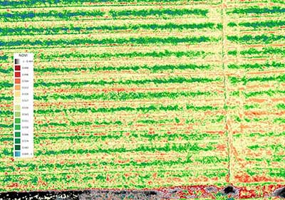

### 8 - Results Using Balloons and Kites

#### Introduction

When our project was initiated the plan was to use methods that are readily available to anyone and to apply these in 
ways that do not impose a high barrier in terms of time and materials. Farmers are generally practical with regard to the 
kinds of tools they are willing to try. Most are eager to learn a new method if it helps them solve 
a long-standing problem more efficiently. As an example, crop scouting has existed as long as farming has and its methods 
have changed little except what was once done on foot or by horse is now done in a pick-up truck. If a kite and a modified camera 
can do the same work while adding more information for less effort then chances are these tools will be adopted.

###### Figure 1. RGB image captured with a Delta kite at height of 100ft. Ground control points (in yellow) are visible.

#### Image capture and preparation

With that sentiment in mind we discuss results obtained by experimenting with kites and balloons. 
__Figure 1__ is a RGB composite image stitched together 'by hand' with the help of ground control points (GCPs) 
spray-painted into the field. Having GCPs in a set of images like this is critical to both stitch together the larger 
image and to compare image sets over successive days. To support this process we used an open source software known as 
[Fiji](https://fiji.sc/). Fiji is an image processing package that bundles an incredible variety of plugins to facilitate 
scientific image analysis.  

To determine the height of a flight we carefully measured and marked the kite's flight line. This set of 
captures was taken at a height of about 100ft. Maintaining a steady altitude like this with a kite can be a challenge when the 
wind is variable. 

#### JPEG versus RAW Format

In addition to challenges imposed by weather are those associated with the type of camera used. 
Among these is the choice of an image format. A common default for consumer cameras is to record images in the JPG (Joint Photographic Experts Group) format. A 
JPEG-produced image has processing built in at the time of capture, to adjust contrast, reduce noise 
or brighten and sharpen the image before rendering it to a file. These processing steps are intended 
to render images that are visually appealing to the human eye. As a result pixel values of a JPG-processed image lack a 
true relationship with the intensity of light that originally impinges on the sensor. Details regarding how a 
JPEG file is processed by a particular camera are not easy to come by and disabling such 'features' is usually not a practical option.

Other sources of artifact in JPEG images are compression and band distortion. Digital Image 
Compression (DIC) attempts to address the issue of storage and transmission since space is usually at a premium in a consumer-grade 
camera. For our purposes, image pre-processing, compression and band distortion are less features than issues to be corrected. 
They impact an ability to utilize _all_ the bandwidth data in post-processing.

As an alternative, some consumer cameras support the RAW format, which preserves all of the bandwidth data. However, RAW images are larger 
than JPEGs and the rate of capture required during flight (to achieve an acceptable ground resolution) makes their
use prohibitive. For this reason our results using consumer cameras are based on the JPEG format. How to accurately calibrate for reflectance 
under changing illuminant conditions while limited to JPEG is an issue that has been addressed by others (for
work in this area see Public Lab postings [here](https://publiclab.org/notes/nedhorning/07-10-2014/using-a-raw-image-to-calibrate-a-jpeg-image)
and [here](https://publiclab.org/notes/nedhorning/06-30-2015/automating-ndvi-calibration)). 

Finally, the lack of accurate geo-tagging support in most consumer cameras means there's no reliable source of reference regarding planar as well as 
vertical positioning of the camera with respect to the ground. A hand-held GPS device was used to create the ground
control points in these images but it was not always possible 'geo-tag' images and match each capture with a known position 
on the ground. Having obtained a set of images we then scripted a process in Fiji to help align, stitch and create the vegetation index.  
   
#### Post-processing JPEG images from a kite flight.
Details regarding how to create a vegetation index such as NDVI using the Fiji software package are described in detail by Chris Fastie
and Ned Horning on Public Lab's website [here](https://publiclab.org/wiki/photo-monitoring-plugin) and 
[here](https://publiclab.org/notes/nedhorning/5-31-2012/registering-and-processing-photos-acquired-two-cameras). 
The [Public Lab](https://publiclab.org/) community has been a leader in this field and the information they have compiled 
over the years has served both as inspiration and as a guide throughout our work. 

###### Figure 2. NDVI image processed using Fuji. This image was captured with a Delta kite at a height of 125ft.
__Figure 2__ is an NDVI index derived from RGB and NIR imagesets using a pair of modified consumer cameras. It was taken 
from a height of about about 125 ft early in the growth season.  

###### Figure 3. NDVI image from 200 ft. Ground resolution is 8-10" ft per pixel.
__Figure 3__ is another NDVI index derived from RGB and NIR image sets using a pair of modified consumer cameras. It was taken 
from a height of about 200 ft.   

Lorem ipsum dolor sit amet, consectetur adipiscing elit, sed do eiusmod tempor incididunt ut labore et dolore magna aliqua. Ut enim ad minim veniam, quis nostrud exercitation ullamco laboris nisi ut aliquip ex ea commodo consequat. Duis aute irure dolor in reprehenderit in voluptate velit esse cillum dolore eu fugiat nulla pariatur.

Lorem ipsum dolor sit amet, consectetur adipiscing elit, sed do eiusmod tempor incididunt ut labore et dolore magna aliqua. Ut enim ad minim veniam, quis nostrud exercitation ullamco laboris nisi ut aliquip ex ea commodo consequat. Duis aute irure dolor in reprehenderit in voluptate velit esse cillum dolore eu fugiat nulla pariatur.

1 meter per pixel

3 inches per pixel

~1 inch per pixel (2.7 cm)

Lorem ipsum dolor sit amet, consectetur adipiscing elit, sed do eiusmod tempor incididunt ut labore et dolore magna aliqua. Ut enim ad minim veniam, quis nostrud exercitation ullamco laboris nisi ut aliquip ex ea commodo consequat. Duis aute irure dolor in reprehenderit in voluptate velit esse cillum dolore eu fugiat nulla pariatur.

#### Summary

Early in the project we experimented with various capture systems (automatically-triggered cameras) and suspension methods 
using kites and balloons. The central challenge of an aerial system based on wind alone is variability in the 
control of height and nadir positioning of the camera. Wind can impact the performance of a balloon during flight. 
Additional factors to consider are payload weight and total flight time. 

Lorem ipsum dolor sit amet, consectetur adipiscing elit, sed do eiusmod tempor incididunt ut labore et dolore magna aliqua. Ut enim ad minim veniam, quis nostrud exercitation ullamco laboris nisi ut aliquip ex ea commodo consequat. Duis aute irure dolor in reprehenderit in voluptate velit esse cillum dolore eu fugiat nulla pariatur.

###### References

[TBD]

 