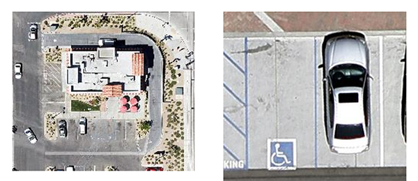

#### Results Using Balloons and Kites

###### Section I

* The Issue with Resolution
* Lorem ipsum dolor sit amet
* Lorem ipsum dolor sit amet

__Figure 1__ Ground resolution of one meter per pixel.
 

__Figure 2__ Ground resolution of 3 inches per pixel.

###### Section II

* Lorem ipsum dolor sit amet
* Lorem ipsum dolor sit amet
* Lorem ipsum dolor sit amet

__Figure 3__ RGB image captured with a Delta kite at height of 200ft. Ground control points are visible as yellow 'x').

__Figure 4__ NDVI image with Fastie color LUT. Captured with a Delta kite at height of 200ft. Ground resolution is 8-10" ft per pixel.

###### Section III

* Lorem ipsum dolor sit amet

__Figure 5__ Ground resolution of 2.7 centimeters (~1 inch) per pixel.

###### References