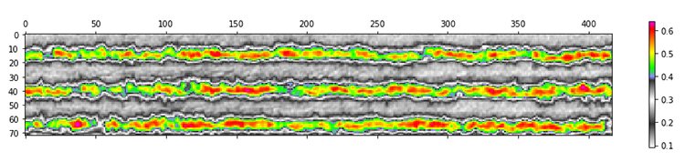
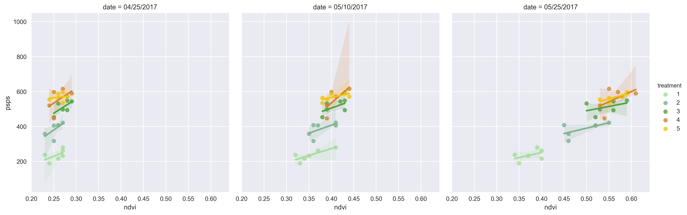
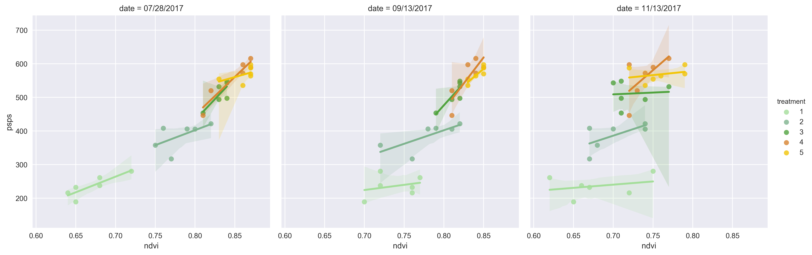
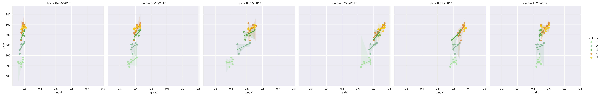
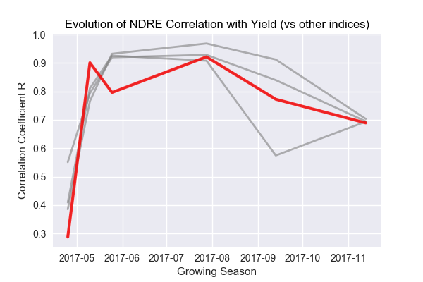

### 9 - Results Using Drones

#### Material and Methods

* An area of second-year sugar cane 'stubble' measuring 1000 ft by 180 ft was dedicated during the 2017 year.
* A series of random sections were laid out and treated with variable amounts of N fertilizer. 
* An aerial drone (described in [Section 4](study_methods.md)) was flown to capture the image data.  

Once planted, a stand of sugar cane may be harvested up to four times in as many seasons. A season runs about 9 months 
and after each harvest the cane remaining in the ground sends up new shoots. While successive harvests give decreasing 
yields, the crop used in this study (a second-year 'stubble') is an ideal 'nitrogen-absorber' and was thus well-suited. 

For the 2017 season, a single-factor field trial was laid out in a common randomized split-plot design on 19 April 2017. 
	

###### Figure 1. Study Area. 

Five levels of nitrogen fertilization (0, 40, 80, 120 and 180 kg·N·ac−1) were applied in a setup with six replicates. 
This resulted in 30 plots of size 100 × 60 sq ft each making a total trial size of 2.75 acres. 

###### Figure 1. Study Area. 

Sugarcane growth was monitored at 6, 21, 36, 100, 147, and 208 days following N treatment. At 216 days following treatment, 
the experimental plots were harvested to provide estimates of agricultural yield. The yield was measured following manual 
harvesting and weighing by means of load cells.

We performed drone flights over the study area during the 2017 growth season. The study area was flown and captured over 
two separate flights (for power consumption reasons) where each flight overlapped in the center of the field. Calibration 
of the Sequoia camera was performed between each flight. 

A primary advantage of the drone compared with other methods is the ability to pre-program an exact height (250ft) and range 
prior to each flight. This advantage is clearly demonstrated in __Figure 2__ of the area taken from  'nadir' perspective. It shows 
two 100ft x 60 ft sections in perspective. Here the precision offered by semi-autonomous, programmable drones easily 
outshines the other aerial methods used.  

###### Figure 2. Individual Sections.   

#### Section II

* After pre-processing steps, each flight yielded a single composite image.
* The composite image was segmented by an automated process into the thirty individual sections.  
* Statistical analyses was performed on each section in terms of four spectral indices.

To capture the study area each drone flight yielded roughly 1200-1500 geotiff images using the [Sequoia camera]() representing 
four narrow bands of light (plus RGB). The raw single band images were layered to produce from 300-350 composite images 
which were then stitched into a single master geotiff containing all four bands (minus RGB). The process of stitching 
geo-coded images is known as mosaicking (see [Section VI](pre_processing_steps.md) ). Mosaiking allows accurate placement of 
acquired image data and projection of those data onto a map. The process is facilitated in this study by embedded latitude and 
longitude tags in each image captured by the Sequoia camera. This allows us to create images of relatively high definition 
containing a broader field of view. 

###### Figure 3. A detail of two treatment sections as a CIR composite image.   

The image in __Figure 3__ has been rendered as an CIR composite for practical reasons. While  since the original raw geotiff from which it was produced is not easily visualized

As mentioned, the composite image contains geotags which form part of the image's metadata. One of the challenges of 
precision mapping is to correctly match a partial image - which may have been distorted in the process of capture - with an 
actual landmark on the ground. Often this process is facilitated through use of ground control points (GCPs). A GCP is an 
invariant point of reference on the ground that stitching software uses to match up points in an image. For our purposes this
process was aided by using a camera that accurately records latitude and longitude points in each image such that they are 
accurately matched in the final composite. A single GCP was used throughout the study, physically placed into the ground 
and referenced from a known surveyor's benchmark. The GCP is located in the right-most part of the following image near 
the intersection of two white lines.     

###### Figure 4. Section grids in a CIR composite.   

_Figure 4_ shows results of a flight which occurred on July 28, 2017. This image has been rendered as an NRG 
for practical reasons since the original raw geotiff from which it was produced is not easily visualized. The image clearly 
shows, as red light, the conditional coloring of luminosities in the near infrared band. Also visible are differences in 
the areas that have been treated with variable amounts of nitrogen.

Our treatment schedule for 2017 was __0__ lbs N per acre, __40__ lbs, __80__ lbs, __120__ lbs, and __180__ lbs per acre.
These amounts were chosen as they reflect a sensible range around the recommended treatment for this particular species 
(120 lbs per acre).

#### Section III

* Individual treatments (per section) were analyzed using semi-automatic methods in order to enhance reproducibilty of results.
* Care was taken to analyze young versus mature crop and to normalize these different conditions for comparison.

The development and growth of the leafy part of the sugar cane plant plays an important part in helping to maximize the 
interception of solar energy for photosynthesis. This leads to the accumulation of biomass and ultimately to a higher crop 
yield [1]. Canopy closure in sugar cane represents that point in the growth season where the adjoining tops of two rows come
together and obscure from above the cane stalks below.   

###### Figure 5.

Lorem ipsum dolor sit amet, consectetur adipiscing elit, sed do eiusmod tempor incididunt ut labore et dolore magna aliqua.

###### Figure 6.

Lorem ipsum dolor sit amet, consectetur adipiscing elit, sed do eiusmod tempor incididunt ut labore et dolore magna aliqua. Ut enim ad minim veniam, quis nostrud exercitation ullamco laboris nisi ut aliquip ex ea commodo consequat. Duis aute irure dolor in reprehenderit in voluptate velit esse cillum dolore eu fugiat nulla pariatur. Excepteur sint occaecat cupidatat non proident, sunt in culpa qui officia deserunt mollit anim id est laborum.

###### Figure 7.

###### Figure 7.

All graphs shown below represent NDVI or other index values from each of thirty test plots (as single data points) 
where each has been colored to represent an amount of N fertilizer received by that plot. 
As an example the graph in Figure [x] below shows NDVI values on July 28th, 2017, at the height of the 
growing season. At this time in the season is when the highest degree of correlation between each set of treatment values and 
the ultimate sucrose yield for that section occurred. 

###### Figure 8. foo bar foo bar foo bar foo bar foo bar foo bar foo bar foo bar foo bar 

The graph in Figure [x] above shows NDVI values during the first month of the growing season, from late April, 2017 
(one week following application of N fertilizer) to late May.

Lorem ipsum dolor sit amet, consectetur adipiscing elit, sed do eiusmod tempor incididunt ut labore et dolore magna aliqua. Ut enim ad minim veniam, quis nostrud exercitation ullamco laboris nisi ut aliquip ex ea commodo consequat. Duis aute irure dolor in reprehenderit in voluptate velit esse cillum dolore eu fugiat nulla pariatur.

###### Figure 9.

Lorem ipsum dolor sit amet, consectetur adipiscing elit, sed do eiusmod tempor incididunt ut labore et dolore magna aliqua. Ut enim ad minim veniam, quis nostrud exercitation ullamco laboris nisi ut aliquip ex ea commodo consequat. Duis aute irure dolor in reprehenderit in voluptate velit esse cillum dolore eu fugiat nulla pariatur.

###### Figure 10.

Lorem ipsum dolor sit amet, consectetur adipiscing elit, sed do eiusmod tempor incididunt ut labore et dolore magna aliqua. Ut enim ad minim veniam, quis nostrud exercitation ullamco laboris nisi ut aliquip ex ea commodo consequat. Duis aute irure dolor in reprehenderit in voluptate velit esse cillum dolore eu fugiat nulla pariatur.

_corrected ndvi_

_ndre_

_gndvi_

_ndvi_

###### Figure 11. Regression 'facets' showing index values versus yield (April to November 2017).

Lorem ipsum dolor sit amet, consectetur adipiscing elit, sed do eiusmod tempor incididunt ut labore et dolore magna aliqua. Ut enim ad minim veniam, quis nostrud exercitation ullamco laboris nisi ut aliquip ex ea commodo consequat. Duis aute irure dolor in reprehenderit in voluptate velit esse cillum dolore eu fugiat nulla pariatur.

Lorem ipsum dolor sit amet, consectetur adipiscing elit, sed do eiusmod tempor incididunt ut labore et dolore magna aliqua. Ut enim ad minim veniam, quis nostrud exercitation ullamco laboris nisi ut aliquip ex ea commodo consequat. Duis aute irure dolor in reprehenderit in voluptate velit esse cillum dolore eu fugiat nulla pariatur.

###### Figure 12. Correlation of NDVI-C Index with Yield (lbs sugar per section).

__Figure 12__ shows the temporal evolution of a 'soil-corrected' spectral index during the 2017 growing season.  

###### Figure 13. Correlation of NDRE Index with Yield (lbs sugar per section).

__Figure 13__ shows the temporal evolution of the NDRE spectral index during the 2017 growing season.  

###### Figure 14. Correlation of GNDVI Index with Yield (lbs sugar per section).

__Figure 14__ shows the temporal evolution of the GNDVI spectral index during the 2017 growing season.  

###### Figure 15. Correlation of NDVI Index with Yield (lbs sugar per section).

__Figure 15__ shows the temporal evolution of the NDVI spectral index during the 2017 growing season.  

#### Summary

Lorem ipsum dolor sit amet, consectetur adipiscing elit, sed do eiusmod tempor incididunt ut labore et dolore magna aliqua. Ut enim ad minim veniam, quis nostrud exercitation ullamco laboris nisi ut aliquip ex ea commodo consequat. Duis aute irure dolor in reprehenderit in voluptate velit esse cillum dolore eu fugiat nulla pariatur.

###### References

[TBD]

 
