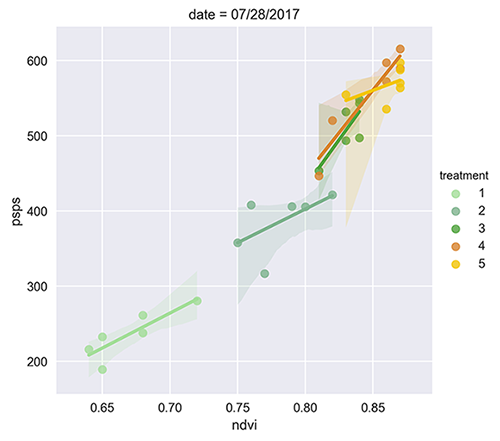
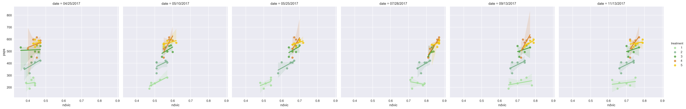

### Results Using Drones

#### Section I

* An aerial drone (described in [Study Methods](study_methods.md)) was flown regularly during the growing season.  
* The study area comprised a section of second-year 'stubble' cane measuring 1000 ft by 180 ft. (_Figure 1_).
* A total of 30 sections were treated with variable amounts of N fertilizer. 

Once planted, a stand of sugar cane may be harvested up to four times in as many seasons. A season runs about 9 months 
and after each harvest the cane remaining in the ground sends up new shoots. While successive harvests give decreasing 
yields, the crop used in this study (a second-year 'stubble') is an ideal 'nitrogen-absorber' and was thus well-suited. 

###### Figure 1. Study Area. 

We performed drone flights over the study area over two successive growing seasons. The results presented are for the 
second season only. In an area measuring roughly 1000 ft by 180 ft we randomly-selected 30 individual plots measuring 
100 feet by 3 rows (roughly 60 ft each). The study area was flown and captured in two separate flights (for power consumption 
reasons ) and calibration was performed between each flight (see [section xxx]() for details). A primary advantage of 
the drone in comparison with other aerial methods used is the ability to pre-program an exact height (250ft) and range for each 
flight. This advantage is clearly demonstrated in __Figure 2__ of the area taken from  'nadir' perspective. It shows 
two 100ft x 60 ft sections in perspective. Here the precision offered by semi-autonomous, programmable drones easily 
outshines the other aerial methods used.  

###### Figure 2. Individual Sections.   

#### Section II

* After pre-processing, each flight yields a single composite image.
* The composite is divided into thirty individual section images.  
* Each section was analyzed in terms of four spectral indices: NDVI, 'corrected' NDVI, 'green' NDVI, and NDRE.
* Statistical analyses were performed on the section images. 

To capture the study area each drone flight yielded roughly 1200-1500 geotiff images using the [Sequoia camera]() representing 
four narrow bands of light, plus a standard RGB image. The raw single band images are layered to produce from 300-350 composite images 
which are then stitched together into a single master geotiff containing all four bands (not RGB). The process of 
stitching together geo-coded images is referred to as 'geo-mosaicing'. Mosaicing allows for accurately acquiring image 
data and then projecting those data onto a map. The mosaicing process is facilitated by highly-accurate latitude and 
longitude tags which are embedded into each image captured by the camera. This allows us to create a much larger image 
containing a much broader field of view. 

###### Figure 3. Sections in a NRG composite image.   

As mentioned, the composite image contains geotags which form part of the image's metadata. One of the challenges of 
precision mapping is to correctly match a partial image - which may have been distorted in the process of capture - with an 
actual landmark on the ground. Often this process is facilitated through use of ground control points (GCPs). A GCP is an 
invariant point of reference on the ground that stitching software uses to match up points in an image. For our purposes this
process was aided by using a camera that accurately records latitude and longitude points in each image such that they are 
accurately matched in the final composite. A single GCP was used throughout the study, physically placed into the ground 
and referenced from a known surveyor's benchmark. The GCP is located in the right-most part of the following image near the intersection of two white lines.     

###### Figure 4. Section grids in a composite NRG image.   

_Figure 4_ shows results of a flight which occurred on July 28, 2017. This image has been rendered as an NRG 
for practical reasons since the original raw geotiff from which it was produced is not easily visualized. The image clearly shows, as red light, the 
conditional coloring of luminosities in the near infrared band. Also visible are differences in the areas that have been
treated with variable amounts of nitrogen.

Our treatment schedule for 2017 was as follows: 

* __1__ -   0 lbs N per hectare (6 sections)
* __2__ -  40 lbs N per hectare (6 sections)
* __3__ -  60 lbs N per hectare (6 sections)
* __4__ -  80 lbs N per hectare (6 sections)
* __5__ - 120 lbs N per hectare (6 sections)

These amounts were chosen as they reflect a sensible range around the recommended treatment for this particular species (80 lbs 
per hectare).

#### Section III

* Individual treaments (per section) were analyzed using semi-automatic methods in order to enhance reproducibilty of results.
* Care was taken to analyze young versus mature crop and to normalize these different conditions for comparison.

The development and growth of the leafy part of the sugar cane plant plays an important part in helping to maximize the 
interception of solar energy for photosynthesis. This leads to the accumulation of biomass and ultimately to a higher crop 
yield [1]. Canopy closure in sugar cane represents that point in the growth season where the adjoining tops of two rows come
together and obscure from above the cane stalks below.   
 

###### Figure 5.

Lorem ipsum dolor sit amet, consectetur adipiscing elit, sed do eiusmod tempor incididunt ut labore et dolore magna aliqua.

###### Figure 6.

Lorem ipsum dolor sit amet, consectetur adipiscing elit, sed do eiusmod tempor incididunt ut labore et dolore magna aliqua. Ut enim ad minim veniam, quis nostrud exercitation ullamco laboris nisi ut aliquip ex ea commodo consequat. Duis aute irure dolor in reprehenderit in voluptate velit esse cillum dolore eu fugiat nulla pariatur. Excepteur sint occaecat cupidatat non proident, sunt in culpa qui officia deserunt mollit anim id est laborum.

###### Figure 7.

All graphs shown below represent NDVI or other index values from each of thirty test plots (as single data points) 
where each has been colored to represent an amount of N fertilizer received by that plot. 
As an example the graph in Figure [x] below shows NDVI values on July 28th, 2017, at the height of the 
growing season. At this time in the season is when the highest degree of correlation between each set of treatment values and 
the ultimate sucrose yield for that section occurred. 

###### Figure 8.

The graph in Figure [x] above shows NDVI values during the first month of the growing season, from late April, 2017 
(one week following application of N fertilizer) to late May.

Lorem ipsum dolor sit amet, consectetur adipiscing elit, sed do eiusmod tempor incididunt ut labore et dolore magna aliqua. Ut enim ad minim veniam, quis nostrud exercitation ullamco laboris nisi ut aliquip ex ea commodo consequat. Duis aute irure dolor in reprehenderit in voluptate velit esse cillum dolore eu fugiat nulla pariatur.

_ndvi_

_corrected ndvi_

_gndvi_

_ndre_

###### Figure 9. Regression plots of index values versus yield, April to November 2017.

Lorem ipsum dolor sit amet, consectetur adipiscing elit, sed do eiusmod tempor incididunt ut labore et dolore magna aliqua. Ut enim ad minim veniam, quis nostrud exercitation ullamco laboris nisi ut aliquip ex ea commodo consequat. Duis aute irure dolor in reprehenderit in voluptate velit esse cillum dolore eu fugiat nulla pariatur.

Lorem ipsum dolor sit amet, consectetur adipiscing elit, sed do eiusmod tempor incididunt ut labore et dolore magna aliqua. Ut enim ad minim veniam, quis nostrud exercitation ullamco laboris nisi ut aliquip ex ea commodo consequat. Duis aute irure dolor in reprehenderit in voluptate velit esse cillum dolore eu fugiat nulla pariatur.

Lorem ipsum dolor sit amet, consectetur adipiscing elit, sed do eiusmod tempor incididunt ut labore et dolore magna aliqua. Ut enim ad minim veniam, quis nostrud exercitation ullamco laboris nisi ut aliquip ex ea commodo consequat. Duis aute irure dolor in reprehenderit in voluptate velit esse cillum dolore eu fugiat nulla pariatur.

Lorem ipsum dolor sit amet, consectetur adipiscing elit, sed do eiusmod tempor incididunt ut labore et dolore magna aliqua. Ut enim ad minim veniam, quis nostrud exercitation ullamco laboris nisi ut aliquip ex ea commodo consequat. Duis aute irure dolor in reprehenderit in voluptate velit esse cillum dolore eu fugiat nulla pariatur.

###### References

1. N. A. Streck, J. G. Hanauer, L. F. Gabriel, T. C. Buske, and J. A. Langner, “Leaf development and growth of selected sugarcane clones in a subtropical environment,” Pesquisa Agropecuária Brasileira, vol. 45, no. 10, pp. 1049–1057, 2010.

 
