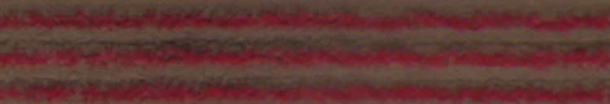
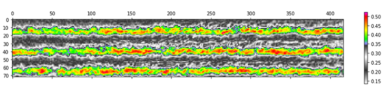
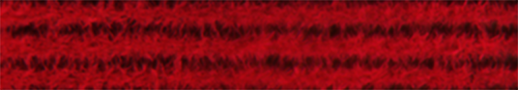
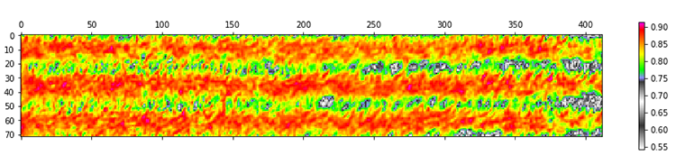
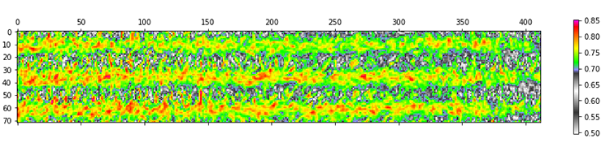

### 9 - Results Using Drones

#### Material and Methods

* An area of second-year sugar cane 'stubble' measuring 1000 ft by 60 ft was dedicated during the 2017 year.
* A series of random sections were laid out and treated with variable amounts of nitrogen fertilizer. 

Once planted, a stand of sugarcane may be harvested up to four times in as many seasons. In Louisiana, a season runs about 9 months 
and after each harvest the cane remaining in the ground sends up new shoots. While successive harvests yield decreasing 
amounts of sucrose, the crop used in this study (a second-year 'stubble') is an ideal 'nitrogen-absorber' and was thus well-suited. 

For the 2017 season, a single-factor field trial was laid out in a common randomized split-plot design on 19 April 2017. 
	

###### Figure 1. Ellendale study area measuring 1000 by 60 ft, 1.5 acres total. 

Five levels of nitrogen fertilization (0, 40, 80, 120 and 180 kg·N·ac−1) were applied in a setup with six replicates. 
This resulted in 30 plots of size 100 × 20 sq ft each making a total trial size of 1.5 acres. 

###### Figure 2. Treatment schedule applied during the 2017 sugarcane season.

Sugarcane growth was monitored at 6, 21, 36, 100, 147, and 208 days following N treatment. At 216 days the experimental 
plots were harvested and analysis of sucrose yields was performed. The yield was measured following manual harvest and 
weighing by means of load cells.

Drone flights were made over the area during the 2017 growth season on eleven separate occasions. Data from half of 
these flights were used in the analysis. The study area was flown and captured over two separate flights for each date (due to power consumption 
reasons) where each flight overlapped in the center of the field. Calibration of the Sequoia camera was performed between each flight. 

A primary advantage of the drone compared with other methods is the ability to pre-program an exact height (250ft) and range 
prior to each flight. This advantage is clearly demonstrated in __Figure 2__ taken from  'nadir' perspective. It shows 
two 100 x 60 ft sections in perspective. As indicated here the precision offered by semi-autonomous, programmable drones 
outperforms other aerial methods considered.  

###### Figure 3. A 'nadir' view indicating the relative scale of individual sections.

#### Processing Steps

* After pre-processing, each flight yielded a single composite image.
* The composite was segmented by an automated process into the thirty individual sections.  
* Statistical analyses was performed on each section in terms of four spectral indices.

To capture the study area each drone flight yielded roughly 1200-1500 geotiff images using the Sequoia camera. Raw single 
band images containing the four bands of light (plus RGB) were layered to produce from 300-350 composites. These composite 
images were then stitched together into a single master geotiff. 

The process of stitching geo-coded images is known as mosaicking (see [Section 6](pre_processing_steps.md) ). Mosaiking allows accurate placement of 
acquired image data and projection of those data onto a map. The process was facilitated in this study by embedded latitude and 
longitude tags in each image captured by the Sequoia camera. This allows us to create images of relatively high definition 
containing a broader field of view. 

###### Figure 4. A detail of two treatment sections rendered as a CIR composite image.   

The image in __Figure 4__ has been rendered as an CIR composite for visualization purposes. The original raw geotiff 
from which it was produced contains only luminosity data from the four bands of captured light. The original composite 
also contains geotags which form part of the image's metadata. One of the challenges of precision mapping is to correctly 
match a partial image - which may have been distorted in the process of capture - with an actual landmark on the ground. 

The process of stitching is often facilitated through use of ground control points (GCPs). A GCP is an invariant point of reference 
on the ground that stitching software uses to better align corresponding points in an image. For our purposes this
process was aided by use of a camera that accurately records and embeds latitude, longitude and elevation data in each image 
such that they are matched together in the final composite. GCP's referenced from a surveyor's benchmark were also used and were 
physically located in the ground.

###### Figure 5. A CIR composite showing section detail and the grid used to apply different nitrogen amounts. Color differences indicate different treatments.   

__Figure 5__ shows results of a flight which occurred on July 28, 2017. This image has been rendered as an CIR composite 
and clearly shows, as red light, the conditional coloring of luminosities in the near infrared band. Also visible are differences in 
areas that have been treated with variable amounts of nitrogen.

Our treatment schedule for 2017 was __0__ lbs N per acre, __40__ lbs, __80__ lbs, __120__ lbs, and __180__ lbs per acre.
These amounts were chosen as they reflect a sensible range around the recommended treatment for this particular species 
(120 lbs per acre).

#### Comparing Plots

* Section treatments were analyzed during early, mid, and late-season growth.

Prior to analysis the master geotiff file for each date (containing precise coordinates of latitude and longitude) was sectioned 
to produce thirty consistent areas representing each treatment section. Sectioning was performed using an automated method guided
by embedded latitude and longitude coordinates.    
  
The development and growth of the leafy part of the sugar cane plant plays a role in helping to maximize the 
interception of solar energy for photosynthesis. This leads to the accumulation of biomass and ultimately to a higher crop 
yield. Our first successful data capture occurred just a week following treatment of the sections with nitrogen.  

###### Figure 6. CIR composite image, NDVI versus GNDVI index in an early sugar cane crop. 

In __Figure 6__ three images from early in the season are displayed: on top is a CIR composite of a single section (taken on 
April 25, 2017) followed by two index images below processed from the same section for NDVI and GNDVI. The color bars to 
the right represent index values on a scale of 0 to 1. The mean 'soil-corrected' index value for each section was __0.46__ 
for NDVI and __0.4__ for GNDVI. These values were generated for all sections, for all treatments, and used in the final 
regression analysis. Our approach was to average a cumulative 'index signal' for each section and then compare this with 
the final sucrose yield for that section following harvest. 
 

###### Figure 7. CIR composite image, NDVI versus GNDVI index in mid-season sugarcane growth. 

In __Figure 7__ a CIR composite, NDVI and GNDVI from a section taken on July 28, 2017 are shown. The mean 'soil-corrected' 
index value for these was __0.83__ for NDVI and __0.73__ for GNDVI. Given the obvious visual difference of these two images,
that the values are basically equivalent (after accounting for the scale difference) is of interest. 

#### A Digression on Regression Analysis

Regression is a statistical technique used to estimate relationships among variables where focus is often put on a 
dependent variable along with one or more independent variables. The independent variable is the 'predictor' 
while the dependent variable is the quantity one hopes to predict. During our study a question was posed regarding whether two 
variables might be correlated with one another and to what degree. Another was asked regarding whether one variable might be predictive of the other.

There's a popular truism in statistics: 'correlation does not imply causation'. The saying carries with it a negative 
connotation, as if correlation were something of lesser value. When one finds a correlation between 
variables it can be tempting to say that there must be a causative relationship between the two. However, while we present evidence of 
correlation between vegetation index values and sucrose yield there is no causative element here (obviously 
the index didn't cause the sugarcane to form sucrose). Still, correlation and other measures of association can be 
useful for purposes of prediction _irrespective_ of a causative connection.
  
Our 'dependent' variable was the amount of sucrose produced in each of thirty sections treated with a known level of 
nitrogen. The final yields (numbering 30) were measured in the lab at the end of the season and, along with our 'independent' 
variable, were known prior to analysis. 

The graph in __Figure 8__ is a scatterplot of sixteen points each representing a single treatment. Each point is colored 
in terms of the treatment received by that section. On the 'x' axis are NDVI values and on the 'y' axis are 'pounds sucrose per section' 
(PSPS).

We have spoken of the bugbear of cumulative error and that issue is no where more relevant than here in __Figure 8__. 
The values representing each data point (there are six per treatment group) are index values averaged over a set of 30,000 pixels 
representing an area of 100 ft by 20 ft. All points of error previously discussed regarding the accuracy of a camera's placement, 
the prevailing wind, sun angle, azimuth, and a hundred others are focused in every point in the graph. And yet in spite of this we see a very logical pattern of
correlation. These data were captured on July 28, 2017 at the height of the grand growth phase. The index type 
shown is NDVI.     
 
 

###### Figure 8. Scatterplot of a vegetation index (NDVI) versus sucrose yield, measured in pounds of sucrose per section (PSPS).

This plot says less on its own than when compared with other plots. However, viewed by itself it does indicate that 
correlation between recorded NDVI values and yield was strongest at 120 lbs N per acre (treatment #4). This is the recommended 
treatment for this variety of sugarcane. The degree of correlation is weaker for treatments both above and below this amount 
with the exception of 80 lbs per acre. 

While a host of additional known and unknown quantities might have served as 'independent' variables for our study (e.g. 
soil moisture content, foliar nitrogen level, canopy structure, the number of growing days) it was not our intention to create
a rigorous scientific report. Our goal was to make a set of recommendations to working sugarcane growers based on analysis 
of results using tools and technologies available at low-cost.   

#### Multiple Regressions

Lorem ipsum dolor sit amet, consectetur adipiscing elit, sed do eiusmod tempor incididunt ut labore et dolore magna aliqua. Ut enim ad minim veniam, quis nostrud exercitation ullamco laboris nisi ut aliquip ex ea commodo consequat. Duis aute irure dolor in reprehenderit in voluptate velit esse cillum dolore eu fugiat nulla pariatur.

###### Figure 9.

#### Animated Results

Lorem ipsum dolor sit amet, consectetur adipiscing elit, sed do eiusmod tempor incididunt ut labore et dolore magna aliqua. Ut enim ad minim veniam, quis nostrud exercitation ullamco laboris nisi ut aliquip ex ea commodo consequat. Duis aute irure dolor in reprehenderit in voluptate velit esse cillum dolore eu fugiat nulla pariatur.

###### Figure 10. Animated plot of correlation evolution between vegetation index (NDVI) and the yield produced by that section.

#### Faceted Regression Results

Lorem ipsum dolor sit amet, consectetur adipiscing elit, sed do eiusmod tempor incididunt ut labore et dolore magna aliqua. Ut enim ad minim veniam, quis nostrud exercitation ullamco laboris nisi ut aliquip ex ea commodo consequat. Duis aute irure dolor in reprehenderit in voluptate velit esse cillum dolore eu fugiat nulla pariatur.

_corrected ndvi_

_ndre_

_gndvi_

_ndvi_

###### Figure 12. Regression 'facets' showing index values versus yield (April to November 2017).

#### Temporal Evolution of Vegetation Index in Sugarcane

Lorem ipsum dolor sit amet, consectetur adipiscing elit, sed do eiusmod tempor incididunt ut labore et dolore magna aliqua. Ut enim ad minim veniam, quis nostrud exercitation ullamco laboris nisi ut aliquip ex ea commodo consequat. Duis aute irure dolor in reprehenderit in voluptate velit esse cillum dolore eu fugiat nulla pariatur.

Lorem ipsum dolor sit amet, consectetur adipiscing elit, sed do eiusmod tempor incididunt ut labore et dolore magna aliqua. Ut enim ad minim veniam, quis nostrud exercitation ullamco laboris nisi ut aliquip ex ea commodo consequat. Duis aute irure dolor in reprehenderit in voluptate velit esse cillum dolore eu fugiat nulla pariatur.

###### Figure 13. Correlation of NDVI-C Index with Yield (lbs sugar per section).

__Figure 12__ shows the temporal evolution of a 'soil-corrected' spectral index during the 2017 growing season.  

###### Figure 14. Correlation of NDRE Index with Yield (lbs sugar per section).

__Figure 13__ shows the temporal evolution of the NDRE spectral index during the 2017 growing season.  

###### Figure 14. Correlation of GNDVI Index with Yield (lbs sugar per section).

__Figure 14__ shows the temporal evolution of the GNDVI spectral index during the 2017 growing season.  

###### Figure 16. Correlation of NDVI Index with Yield (lbs sugar per section).

__Figure 15__ shows the temporal evolution of the NDVI spectral index during the 2017 growing season.  

#### Summary

Lorem ipsum dolor sit amet, consectetur adipiscing elit, sed do eiusmod tempor incididunt ut labore et dolore magna aliqua. Ut enim ad minim veniam, quis nostrud exercitation ullamco laboris nisi ut aliquip ex ea commodo consequat. Duis aute irure dolor in reprehenderit in voluptate velit esse cillum dolore eu fugiat nulla pariatur.

###### References

[TBD]

 
